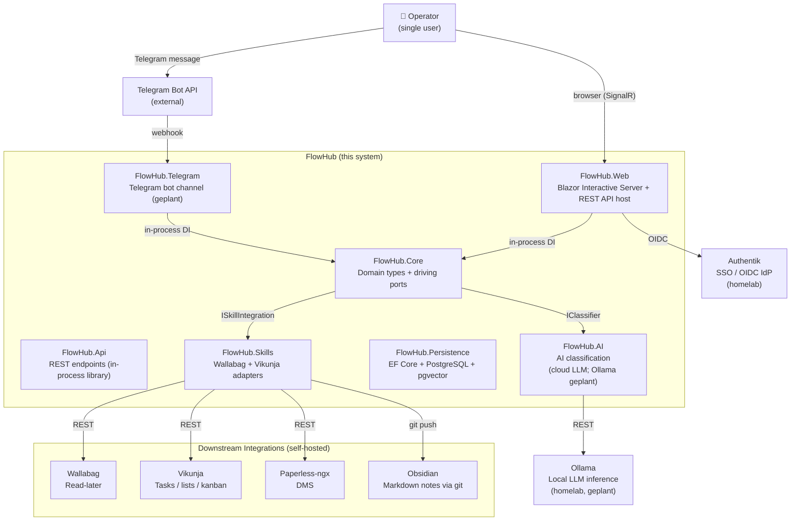
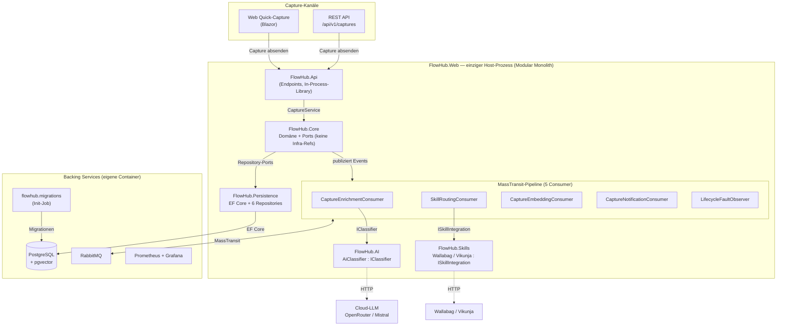
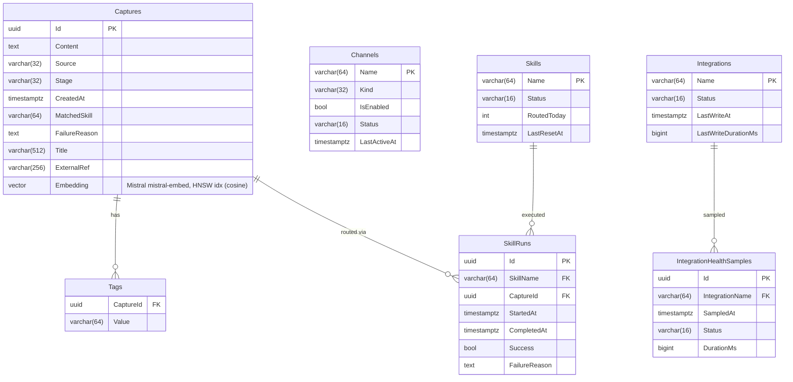
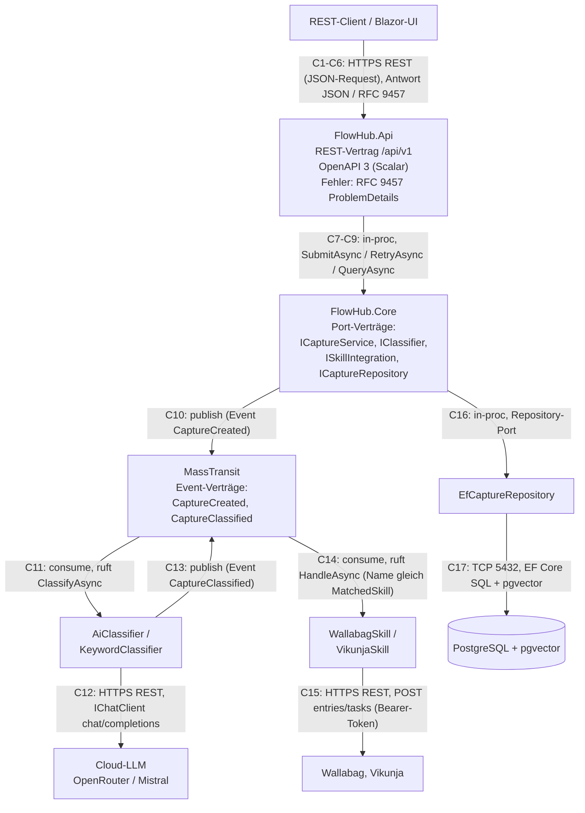
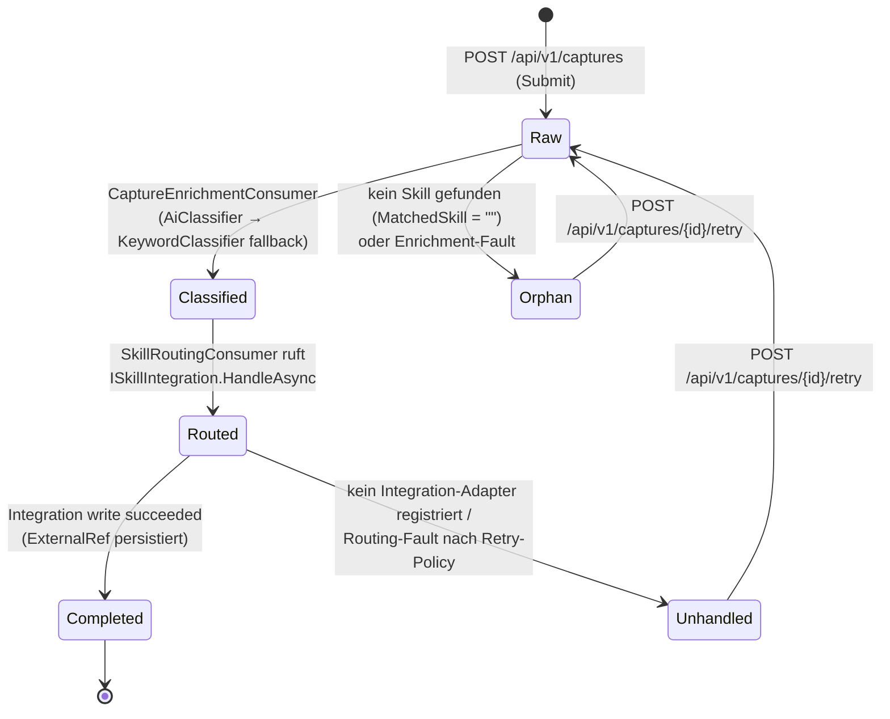
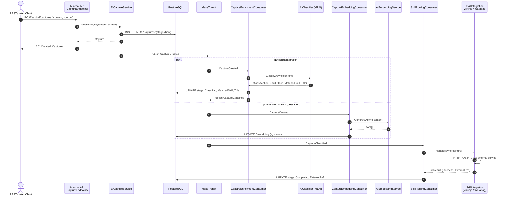
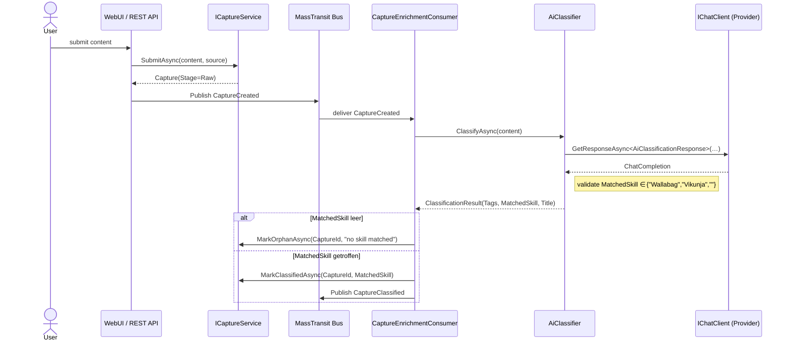
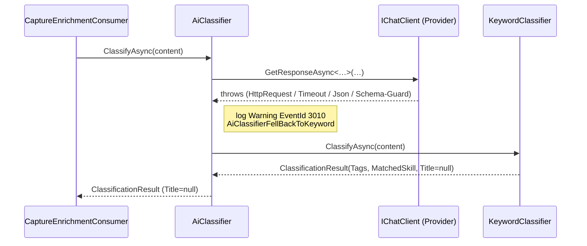
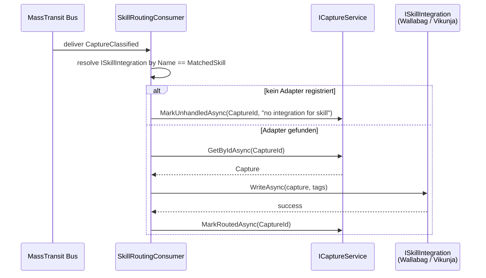
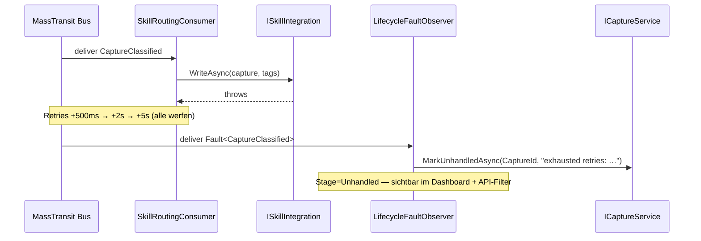

# FlowHub – Arc42 Architekturdokumentation

**CAS AI-Assisted Software Engineering (AISE)** · W4B-C-AS001 · ZH-Sa-1 · FS26
**Student:** Andreas Imboden
**Version:** 2.0 (as built) · **Stand:** Juni 2026 · **Template:** arc42 v8 (adaptiert)

> **Hinweis zur Version.** Version 1.0 (Februar 2026) dokumentierte die *geplante*
> Konzept-Architektur zu Projektbeginn. Diese Version 2.0 beschreibt die
> **tatsächlich gebaute** Lösung am Abgabestand und kennzeichnet bewusst, wo das
> Konzept (Zielbild) über das Umgesetzte hinausgeht. Die Quell-Artefakte
> (Projektbeschreibung, ADRs 0001–0009, Design-Dokumente) liegen im Repository:
> <https://github.com/freaxnx01/FlowHub-CAS-AISE>.

> 📑 **Navigation:** Das Inhaltsverzeichnis dieses PDFs liegt als
> **Lesezeichen / Outline** vor — im PDF-Viewer über die Seitenleiste erreichbar
> (Adobe Acrobat: *Lesezeichen*; Edge/Chrome: *Inhalt/Document outline*).

---

## 1. Einführung und Ziele

FlowHub ist eine **KI-gestützte persönliche Inbox**. Sie nimmt
Informationsschnipsel aus dem Alltag entgegen (ein Film-Tipp, ein Fachartikel,
ein Beleg-Foto, eine Notiz), **erkennt und klassifiziert** sie automatisch und
**leitet sie an den passenden Ziel-Dienst** weiter — ohne dass der Benutzer im
Moment der Erfassung entscheiden muss, wohin die Information gehört.

Das adressierte Kernbedürfnis ist **„Capture without friction"**: Statt der
heutigen fünf Schritte (Idee → App-Wahl → App öffnen → Kategorisieren → Ablegen)
reduziert FlowHub die Erfassung auf einen einzigen Schritt. Die Klassifikation
übernimmt ein **Skill-basiertes Routing-System**: ein LLM klassifiziert den
Schnipsel, deterministisches Keyword-/URL-Muster-Matching dient als Fallback.

### 1.1 Aufgabenstellung

- **Funktional:** Captures über mehrere Kanäle entgegennehmen, automatisch
  klassifizieren, an den passenden externen Dienst routen und den Lebenszyklus
  jedes Captures (inkl. Fehlerfälle und Retry) nachvollziehbar machen.
- **Qualitativ:** saubere, begründete Architektur (Modular Monolith, hexagonal),
  dokumentierte Architekturentscheidungen (ADRs) und eine reflektierte,
  KI-unterstützte Entwicklungsweise.
- **Rahmen:** Umsetzung inkrementell über die fünf CAS-Blöcke (Einführung,
  Frontend, Service, Persistence, Deployment).

**KI-Nutzen je Kernfunktion** (ein Satz pro Funktion):

- **Erfassung:** KI macht die Ein-Schritt-Erfassung möglich — der Nutzer muss im
  Moment des Capture nicht entscheiden, wohin die Information gehört.
- **Klassifikation:** ein LLM erkennt Typ und Ziel-Skill des Captures, mit
  deterministischem Keyword-Matching als Fallback.
- **Anreicherung:** das LLM ergänzt Titel und Tags, die der Nutzer sonst manuell
  setzen müsste.
- **Routing:** profitiert direkt von der KI-Klassifikation — der richtige
  Ziel-Dienst wird ohne Nutzer-Entscheid gewählt.
- **Semantische Suche:** Embeddings erlauben Suche nach Bedeutung statt nach
  exakten Stichwörtern.

### 1.2 Qualitätsziele

Die Qualitätsziele sind als SMART-Anforderungen in `docs/spec/nfa.md`
spezifiziert (Volltext-Tabelle in Kapitel 10). Die fünf tragenden Ziele:

*Tabelle 1: Qualitätsziele (Auszug)*

| Priorität | Qualitätsziel | Konkretisierung |
|---|---|---|
| 1 | **Performance** | Capture-Listen-Abfrage (Limit ≤ 50) p95 < 100 ms (NfA-01); B-Tree-Indizes auf allen häufigen Filterspalten (NfA-02). |
| 2 | **Betreibbarkeit** | Migrations-first, idempotentes SQL als Init-Container, nie Auto-Migrate in `app.Run()` (NfA-03). |
| 3 | **Zuverlässigkeit** | Npgsql-Connection-Pooling + transiente Retry-Policy (NfA-05); Retry + Fault-Observer in der Async-Pipeline. |
| 4 | **Beobachtbarkeit** | Prometheus-`/metrics`-Endpoint, `dotnet_*`- und `http_*`-Serien (NfA-O1). |
| 5 | **Datenschutz** *(Ziel)* | Verarbeitung möglichst auf eigener Infrastruktur (NfA-P1), KI-Transparenz/Provenienz (NfA-P2) — **noch nicht umgesetzt**, siehe Kapitel 11. |

### 1.3 Stakeholder

*Tabelle 2: Stakeholder*

| Stakeholder | Rolle | Erwartung an die Architektur |
|---|---|---|
| Homelab-Operator (Primärnutzer) | Betreibt FlowHub selbst (Proxmox/Docker), nutzt bereits Vikunja, Wallabag, paperless-ngx | Reibungslose Erfassung; self-hostbar; nachvollziehbarer Verbleib jeder Information |
| „Digital Hoarders" (Sekundär) | Sammeln viel, ohne abzulegen | Niedrigschwellige Erfassung |
| CAS-/FFHS-Dozenten (Bewertung) | Beurteilen die Projektarbeit | Verteilte Web-App mit KI, saubere Architektur, ADRs, KI-Einsatz-Reflexion |

FlowHub ist bewusst ein **Single-Operator-System**, keine Multi-User-Plattform
(siehe Abgrenzung, Kapitel 11 / Projektbeschreibung §10).

### 1.4 Anwendungsfälle (Überblick)

Die funktionalen Anforderungen sind als 18 Anwendungsfälle (UC-01…UC-18) — mit
Akteur, Auslöser, Vorbedingung, Ablauf, Nachbedingung, Fehlerfällen und
Akzeptanzkriterien (inkl. prüfendem Test) — vollständig in `docs/spec/use-cases.md`
spezifiziert. Den Überblick gibt Tabelle 3; **fünf Kernfunktionen** sind in
Kap. 1.5 mit der vollen Struktur direkt in diesem Dokument ausformuliert. Status:
✅ gebaut · ⏳ geplant:

*Tabelle 3: Anwendungsfälle (UC-Überblick)*

| UC | Anwendungsfall | Akteur | Status |
|---|---|---|---|
| UC-01 | Capture via Web-UI erfassen (Quick) | Operator | ✅ |
| UC-02 | Capture via Web-UI erfassen (Langform) | Operator | ✅ |
| UC-03 | Capture via Telegram erfassen | Operator | ⏳ |
| UC-04 | Capture-Health im Dashboard überwachen | Operator | ✅ |
| UC-05 | Captures durchsuchen & filtern | Operator | ✅ |
| UC-06 | Fehlgeschlagenen Capture inspizieren & behandeln | Operator | ✅ |
| UC-07 | Skill- & Integration-Health einsehen | Operator | ✅ |
| UC-08 | Capture via REST-API erfassen | Nicht-UI-Client | ✅ |
| UC-09 | Capture KI-klassifizieren & routen (Async-Pipeline) | System | ✅ |
| UC-10 | Graceful Fallback auf Keyword-Klassifikation | System | ✅ |
| UC-11 | Fehlgeschlagenen Capture per Dashboard erneut routen | Operator | ✅ |
| UC-12 | Captures nach Lifecycle-Stage filtern | Operator | ✅ |
| UC-13 | Captures nach Tag filtern | Operator | ✅ |
| UC-14 | Captures nach Inhalt/Titel suchen | Operator | ✅ |
| UC-15 | Skill-Run-Historie eines Captures ansehen | Operator | ✅ |
| UC-16 | Integration-Health-Historie ansehen | Operator | ✅ |
| UC-17 | Deployment via Docker Compose | Operator | ✅ |
| UC-18 | Semantische Suche über Captures (REST; Cloud-Embedding-Key nötig) | Operator | ✅ |

### 1.5 Ausgewählte Anwendungsfälle (Detail)

Die folgenden fünf Kernfunktionen sind mit voller UC-Struktur (Akteur · Auslöser ·
Vorbedingung · Ablauf · Nachbedingung · Fehler · Akzeptanzkriterien) direkt im
Dokument ausformuliert. Sie decken die operatorseitige Erfassung (UC-01), den
programmatischen Eingangskanal (UC-08), die zentrale KI-Pipeline (UC-09), den
KI-Fallback-Schutz (UC-10) und die Fehler-Wiedervorlage (UC-11) ab. Die übrigen
13 Anwendungsfälle stehen in identischer Struktur in `docs/spec/use-cases.md`.

#### UC-01 — Capture via Web-UI erfassen (Quick)

- **Akteur:** Operator
- **Auslöser:** Operator fügt eine URL ein oder tippt Text in das Quick-Capture-Feld der AppBar.
- **Vorbedingung:** Operator ist authentifiziert (`DevAuthHandler` in Dev, Authentik OIDC in Prod).
- **Ablauf:**
  1. Operator gibt Inhalt in das Quick-Capture-Feld ein.
  2. Operator drückt Enter oder klickt das Submit-Icon.
  3. System legt einen neuen Capture mit `source = Web`, `stage = Raw` an.
  4. System zeigt eine Erfolgs-Snackbar mit Link auf die Capture-Detailseite.
  5. Das Eingabefeld leert sich für die nächste Eingabe.
- **Nachbedingung:** Ein neuer Capture mit `LifecycleStage.Raw` existiert.
- **Fehler:** Leerer Inhalt → Inline-Hinweis „Type something first"; kein Capture angelegt.
- **Fehler:** Service-Fehler → Snackbar „Capture failed: {reason}", Feldinhalt bleibt erhalten.
- **Akzeptanzkriterien:**
  - Nach Enter erscheint binnen 2 s eine `Captured ✓`-Snackbar (Playwright `HappyFlowTests.QuickCapture_TodoEntry_AppearsInCapturesListAndDetail`).
  - Die erfasste Zeile erscheint auf `/captures`, die Detailseite zeigt denselben Inhalt.
  - Leerer Inhalt → keine Zeile, Inline-Hinweis sichtbar.

#### UC-08 — Capture via REST-API erfassen

- **Akteur:** Nicht-UI-Client (Automations-Skript, Telegram-Bot-Modul, künftiger Mobile-Client)
- **Auslöser:** Client sendet `POST /api/v1/captures` mit JSON-Body.
- **Vorbedingung:** Client hält ein gültiges Bearer-Token (Dev-Bypass in Dev; Authentik-OIDC-Token in Prod).
- **Ablauf:**
  1. Client sendet `POST /api/v1/captures` mit `{ "content": "…", "source": "Telegram|Web|Api", "skillOverride": "<SkillId|null>" }`.
  2. FluentValidation an der API-Grenze prüft: `content` nicht leer, `source` ist ein bekannter Enum-Wert. Bei Fehler → `400 Bad Request` als RFC 9457 ProblemDetails (`type`-URI aus `FlowHubProblemTypes`).
  3. Application-Service legt einen `Capture` mit `stage = Raw` an und persistiert ihn.
  4. Service publiziert das Event `CaptureCreated` auf dem internen Bus.
  5. API antwortet `201 Created` mit `Location: /api/v1/captures/{id}` und dem vollständigen Capture-Body.
- **Nachbedingung:** Ein Capture mit `LifecycleStage.Raw` existiert; `CaptureCreated` liegt auf dem Bus und stösst die Async-Pipeline (UC-09) an.
- **Fehler:** Fehlender/ungültiger `content` → `400` ProblemDetails mit `errors`-Map.
- **Fehler:** Unbekannter `source`-Wert → `400` ProblemDetails.
- **Fehler:** Auth fehlt/ungültig → `401 Unauthorized`.
- **Akzeptanzkriterien:**
  - Gültiger Body → 201 binnen NfA (`p95 < 200 ms` serverseitig); verifiziert durch `just smoke-prod` Schritt [5/6] und `tests/FlowHub.Api.IntegrationTests/`.
  - Response-Body entspricht dem `Capture`-Schema; `Location`-Header vorhanden.
  - Fehlender `content` / unbekannter `source` → 400 ValidationProblem (`type` = `validation.md`).

#### UC-09 — Capture KI-klassifizieren & routen (Async-Pipeline)

- **Akteur:** System (keine menschliche Interaktion)
- **Auslöser:** Event `CaptureCreated` auf dem MassTransit-In-Process-Bus.
- **Vorbedingung:** Capture in `Raw`-Stage; MassTransit-Bus läuft.
- **Ablauf:**
  1. Bus liefert `CaptureCreated` an `CaptureEnrichmentConsumer`.
  2. Consumer ruft `IClassifier.ClassifyAsync(capture)`.
  3. Ist ein Provider-Key konfiguriert, sendet `AiClassifier` den Inhalt an das LLM (`MaxOutputTokens=300`, `Temperature=0.2`); sonst direkt `KeywordClassifier`.
  4. `IClassifier` liefert ein `ClassificationResult` mit `MatchedSkill` (nullable) und Tags.
  5. Consumer setzt `stage = Classified` und publiziert `CaptureClassified`.
  6. `SkillRoutingConsumer` löst die `ISkillIntegration` per `Name == MatchedSkill` auf. Treffer → `HandleAsync`, bei Erfolg `stage = Routed → Completed`; kein Treffer → `stage = Orphan`.
  7. Bei Integration-Fehler greift die MassTransit-Retry-Policy (NfA-10); nach Erschöpfung setzt `LifecycleFaultObserver` `stage = Unhandled` mit `FailureReason`.
- **Nachbedingung:** Capture erreicht einen Terminal-Zustand (`Completed`, `Orphan` oder `Unhandled`); Dashboard-Zähler aktualisieren beim nächsten Laden.
- **Fehler:** Provider-Fehler → deterministischer Fallback (UC-10), kein Pipeline-Abbruch.
- **Fehler:** Kein passender Adapter → `Unhandled` nach Retry-Erschöpfung.
- **Akzeptanzkriterien:**
  - URL-Capture erreicht `Completed` mit `MatchedSkill = "Wallabag"` und nicht-leerem `ExternalRef` (Skills.ContractTests + `just test-beta`).
  - Todo-Capture erreicht `Completed` mit `MatchedSkill = "Vikunja"` und nicht-leerem `ExternalRef`.
  - MassTransit-Harness-Tests (`tests/FlowHub.Web.ComponentTests/Pipeline/*`) belegen die Consumer-Hops in Reihenfolge.

#### UC-10 — Graceful Fallback auf Keyword-Klassifikation

- **Akteur:** System (keine menschliche Interaktion)
- **Auslöser:** `AiClassifier.ClassifyAsync` läuft in einen Fehler: Netzwerk-Exception, HTTP-Timeout, JSON-Parse-Fehler, Schema-Verletzung oder generische Exception.
- **Vorbedingung:** AI-Provider konfiguriert; `CaptureEnrichmentConsumer` verarbeitet ein `CaptureCreated`.
- **Ablauf:**
  1. `AiClassifier.ClassifyAsync` führt den LLM-Aufruf in einem try/catch über alle Exception-Typen aus.
  2. Bei einer Exception loggt `AiClassifier` auf Warning mit EventId `3010` (`AiClassifierFellBackToKeyword`), inkl. Exception-Message und Capture-Id.
  3. `AiClassifier` delegiert sofort an `KeywordClassifier.ClassifyAsync` und liefert dessen Ergebnis (`Title = null`).
  4. `CaptureEnrichmentConsumer` fährt normal fort — er erhält ein gültiges `ClassificationResult`, unabhängig vom erzeugenden Classifier.
- **Nachbedingung:** Der Capture ist stets klassifiziert; ein Provider-Ausfall mindert die Qualität, verursacht aber keinen Verfügbarkeitsverlust. Das Warning-Log (EventId 3010) liefert operative Sichtbarkeit.
- **Fehler:** `AiClassifier` wirft nie an den Aufrufer — `ClassifyAsync` liefert immer ein `ClassificationResult`.
- **Akzeptanzkriterien:**
  - Mit absichtlich ungültigem `Ai__OpenRouter__ApiKey` erreicht ein Capture (UC-08) dennoch `Classified` — via `KeywordClassifier` (`tests/FlowHub.Web.ComponentTests/Ai/AiClassifierTests.cs`).
  - EventId `3010 AiClassifierFellBackToKeyword` wird auf Warning mit Exception-Typ und Capture-Id geloggt.
  - `AiClassifier.ClassifyAsync` wirft unter keinen Umständen an den Aufrufer.

#### UC-11 — Fehlgeschlagenen Capture per Dashboard erneut routen

- **Akteur:** Operator
- **Auslöser:** Operator öffnet die Detailseite (`/captures/{id}`) eines `Orphan`/`Unhandled`-Captures und klickt „Retry".
- **Vorbedingung:** Capture in `Orphan`- oder `Unhandled`-Stage; Operator authentifiziert.
- **Ablauf:**
  1. UI ruft `POST /api/v1/captures/{id}/retry`.
  2. Application-Service setzt `stage = Raw` zurück und löscht `FailureReason`.
  3. Service publiziert ein neues `CaptureCreated` für dieselbe Capture-Id.
  4. Die volle Async-Pipeline (UC-09) läuft erneut von vorn.
  5. API antwortet `202 Accepted`; UI zeigt Snackbar „Capture queued for retry" und lädt die Detailseite neu.
- **Nachbedingung:** Der Capture durchläuft die Enrichment-Pipeline erneut; die Lifecycle-Stage wird abhängig vom Ergebnis erneut auf `Routed`, `Orphan` oder `Unhandled` gesetzt.
- **Fehler:** Capture nicht gefunden → `404` ProblemDetails.
- **Fehler:** Stage nicht retry-bar (`Raw`, `Classified`, `Completed`) → `409 Conflict` ProblemDetails.
- **Akzeptanzkriterien:**
  - `POST …/retry` auf einem `Orphan` → 202 Accepted, Body zeigt `stage = Raw`, `failureReason = null` (`tests/FlowHub.Api.IntegrationTests/CaptureRetryEndpointTests.cs`).
  - Derselbe Aufruf auf einem `Completed` → 409 (`type` = `capture-not-retryable.md`).
  - Derselbe Aufruf mit unbekannter Id → 404 (`type` = `capture-not-found.md`).

---

## 2. Randbedingungen

### 2.1 Technische Randbedingungen

| Bereich | Festlegung |
|---|---|
| Plattform | .NET 10 / C# / ASP.NET Core (LTS) |
| Frontend | Blazor Web App (Interactive Server) + MudBlazor als einzige Komponenten-Bibliothek |
| API | ASP.NET Core Minimal APIs, versioniert unter `/api/v1`, Fehler als RFC 9457 ProblemDetails |
| Persistenz | EF Core 10 + PostgreSQL 17 (Image `pgvector/pgvector:pg17`); Code-First-Migrations |
| Messaging | MassTransit (In-Memory in Dev/Test, RabbitMQ in Prod via `Bus__Transport`) |
| KI-Abstraktion | Microsoft.Extensions.AI (`IChatClient`); Provider via `Ai__Provider` wechselbar |
| Build/Betrieb | Multi-Stage-Dockerfile (`sdk:10.0-alpine` → `aspnet:10.0-alpine`, non-root), Docker Compose |
| Konventionen | Warnings-as-Errors, Nullable Reference Types, SemVer, Conventional Commits, 12-Factor |

### 2.2 Organisatorische Randbedingungen

- **CAS-Struktur:** fünf FFHS-Blöcke (1 Konzept, 2 Frontend, 3 Service/REST,
  4 Persistence, 5 Deployment), Abgabe Juli 2026. Jeder Block schliesst mit einer
  dokumentierten Nachbereitung ab, die gegen die Moodle-Bewertungskriterien
  selbst geprüft wird.
- **Dokumentation:** arc42 als Architektur-Vorlage; Architekturentscheidungen als
  ADRs (Kapitel 9).
- **Stack-Wahl:** Die freie Technologie-Wahl wurde in der PVA bestätigt. Wo der
  Kurs einen Quarkus-/Jakarta-EE-Stack als Beispiel nennt, setzt FlowHub
  funktionale .NET-Äquivalente ein (EF Core ↔ Hibernate/Panache, MassTransit ↔
  Queue-basiertes Messaging, MEAI ↔ Spring-AI). Das Programmierkriterium der
  Rubrik ist seit dem Update Juni 2026 framework-neutral.

---

## 3. Kontextabgrenzung

### 3.1 Fachlicher Kontext

FlowHub sitzt zwischen **Eingangs-Kanälen** und **Ziel-Diensten**:

- **Eingangs-Kanäle (gebaut):** Web Quick-Capture (Eingabefeld in der Blazor-
  AppBar) und REST-API `POST /api/v1/captures`. Ein **Telegram-Bot** ist
  konzipiert, aber **nicht umgesetzt**.
- **Ziel-Dienste:** Wallabag (Read-Later), Vikunja (Tasks/Kanban) — beide als
  `ISkillIntegration`-Adapter **gebaut**; paperless-ngx (DMS) in der Live-Demo;
  Obsidian/Git Forge als Wissens-Ablage **geplant**. Fällt keine Zuordnung, bleibt
  der Capture in der FlowHub-Inbox (PostgreSQL).

Skill → Ziel-Dienst (Konzept-Mapping): Artikel → Wallabag; Homelab/Buch/Film →
Vikunja; Dokument → paperless-ngx; Wissen/Zitat → Obsidian/Git Forge; generisch →
Inbox. **Wired am Abgabestand:** Wallabag und Vikunja.

### 3.2 Technischer Kontext



*Abbildung 1: System-Kontext (C4 Level 1)*

> **Ist-Stand-Hinweis.** Das Kontextdiagramm zeigt das Gesamtbild inkl. geplanter
> Bausteine. Am Abgabestand umgesetzt sind die sechs Projekte
> `FlowHub.{Web,Core,Api,AI,Persistence,Skills}` mit Wallabag- und
> Vikunja-Adaptern; **Telegram-Kanal, lokales Ollama, Authentik/OIDC und der
> Obsidian-Pfad sind geplant** (KI läuft heute über Cloud-Provider, Auth über
> Dev-Bypass). paperless-ngx ist nur in der Live-Demo angebunden.

| Beziehung | Mechanismus |
|---|---|
| Operator → Web-UI | HTTP + SignalR (langlebiger Blazor-Interactive-Server-Circuit) |
| Web / API → Core | In-Process-DI (kein HTTP für UI-Daten, ADR 0001) |
| Core → KI-Provider | REST (Cloud: OpenRouter/Mistral heute; lokales Ollama als Ziel, ADR 0007) |
| Skills → externe Dienste | HTTP REST (Wallabag, Vikunja) |
| Web → Authentik (OIDC) | **geplant** — heute Dev-Bypass (`DevAuthHandler`) |

---

## 4. Lösungsstrategie

| Problem / Treiber | Lösungsansatz | Begründung / ADR |
|---|---|---|
| Klare Modulgrenzen ohne Microservice-Overhead | **Modularer Monolith** — ein deploybarer Prozess, Fähigkeiten als getrennte .NET-Projekte, modulübergreifende Aufrufe nur über Ports in `FlowHub.Core` | ADR 0001, ADR 0002 |
| Testbarkeit, austauschbare Infrastruktur | **Hexagonale Schichtung** je Modul — Driving-Ports (`IClassifier`, `ICaptureService`) und Driven-Ports (`ISkillIntegration`, Repositories) im Core, Adapter in den Fähigkeits-Projekten | ADR 0002 |
| Entkopplung Erfassung ↔ Verarbeitung, Resilienz | **Asynchrone Pipeline** über MassTransit (In-Memory in Dev, RabbitMQ in Prod); ausgehende Integrationen synchron innerhalb der Consumer | ADR 0002, ADR 0003 |
| Austauschbarkeit des LLM-Providers | **KI-Provider-Abstraktion** (MEAI `IChatClient`); Anthropic + OpenRouter; `KeywordClassifier` als deterministischer Fallback-Boden | ADR 0004 |
| KI-Suche ohne separate Vektor-DB | **pgvector** auf derselben PostgreSQL statt zusätzlicher Infrastruktur | ADR 0006 |

---

## 5. Bausteinsicht

### 5.1 Ebene 1 — Module (Ist-Architektur)



*Abbildung 2: Ist-Architektur — Bausteinsicht Ebene 1 (modularer Monolith)*

| Modul | Verantwortung |
|---|---|
| `FlowHub.Core` | Domänen-Typen (`Capture`, `Skill`, Health) + Driving-/Driven-Ports (`IClassifier`, `IEmbeddingService`, `ISkillIntegration`, Repository-Interfaces). Keine Infrastruktur-Referenzen. |
| `FlowHub.Web` | Blazor Web App (Interactive Server, MudBlazor) + MassTransit-Consumer (`/Pipeline/`) + Host des Minimal-API. Komponiert `FlowHub.Api` **in-process** (kein separater Container). |
| `FlowHub.Api` | Minimal-API-Endpunkte (`CaptureEndpoints`, `SearchEndpoints`, `AdminEndpoints`) als In-Process-Library. |
| `FlowHub.AI` | `AiClassifier` + `AiEmbeddingService` über MEAI. |
| `FlowHub.Persistence` | EF Core + PostgreSQL + pgvector; sechs `Ef*Repository`-Implementierungen. |
| `FlowHub.Skills` | `ISkillIntegration`-Adapter für Wallabag und Vikunja. |

Diese sechs Projekte bilden die vollständige `FlowHub.slnx`. Telegram-Kanal und
generische Integrations-Schicht sind **geplant, nicht gescaffolded**.

### 5.2 Skill-System (Kernarchitektur)

- **`IClassifier`** (Driving-Port): `ClassifyAsync(content) → ClassificationResult
  (Tags, MatchedSkill, Title?)`. Zwei Adapter: `KeywordClassifier` (Regeln) und
  `AiClassifier` (MEAI; füllt zusätzlich Title).
- **`ISkillIntegration`** (Driven-Port): `Name` + `HandleAsync(Capture) →
  SkillResult`. Auflösung per exaktem `Name` == `MatchedSkill`.
- **`SkillRoutingConsumer`** ist der Dispatcher: kein Treffer → `MarkUnhandledAsync`
  (Capture bleibt in der Inbox).

### 5.3 Ebene 2 — MassTransit-Pipeline (5 Consumer)

Die Async-Pipeline ist die innere Zerlegung des Host-Prozesses. Jeder Consumer
ist ein eigener Baustein mit klarer Verantwortung und eigener Retry-Policy:

| Consumer | Reagiert auf | Verantwortung | Retry |
|---|---|---|---|
| `CaptureEnrichmentConsumer` | `CaptureCreated` | Klassifikation via `IClassifier`; setzt `Classified` oder `Orphan` | `[100ms, 500ms]` |
| `SkillRoutingConsumer` | `CaptureClassified` | Auflösung `ISkillIntegration` per Name; Write; setzt `Routed`/`Unhandled` | `[500ms, 2s, 5s]` |
| `CaptureEmbeddingConsumer` | `CaptureCreated` | Best-Effort-Embedding (pgvector); parallel zum Enrichment | `[500ms, 2s, 5s]` |
| `CaptureNotificationConsumer` | Lifecycle-Events | optionale ntfy.sh-Benachrichtigung | — |
| `LifecycleFaultObserver` | `Fault<…>` | bildet Faults auf `Orphan`/`Unhandled` ab (kein Retry) | keine |

Zwei Events tragen die Pipeline: `CaptureCreated` (nach dem Submit) und
`CaptureClassified` (nach erfolgreicher Klassifikation). Enrichment und Embedding
hängen beide am `CaptureCreated` und laufen damit parallel.

### 5.4 Ebene 2 — Skill-System (Ports & Adapter)

```
Capture submitted
  → IClassifier.ClassifyAsync(content)           (Driving-Port, FlowHub.Core)
      → ClassificationResult { MatchedSkill, Tags, Title? }
  → CaptureClassified (MassTransit-Event)
  → SkillRoutingConsumer
      → ISkillIntegration where Name == MatchedSkill   (Driven-Port, FlowHub.Core)
      → integration.HandleAsync(capture) → SkillResult
```

- **`IClassifier`** — zwei Adapter: `KeywordClassifier` (deterministische Regeln,
  immer `Title = null`) und `AiClassifier` (MEAI; füllt zusätzlich `Title`, fällt
  bei Provider-Fehlern auf `KeywordClassifier` zurück).
- **`ISkillIntegration`** — ein Adapter je Ziel-Dienst, jeder kapselt HTTP/Auth/
  Tagging selbst. Verdrahtet: `Wallabag`, `Vikunja`. Auflösung per exaktem
  `Name`-Match gegen `MatchedSkill`.
- **Einen Skill ergänzen** (Erweiterungspunkt): `ISkillIntegration` in
  `FlowHub.Skills/<Service>/` implementieren, in den DI-Extensions registrieren,
  dem Classifier den neuen `MatchedSkill` beibringen. Roadmap: paperless-ngx,
  Vikunja Kanban, Obsidian/Git Forge teilen denselben Vertrag.

### 5.5 Paketstruktur

Flaches Layout `source/FlowHub.<Capability>/` (ADR 0001). Keine
Sibling-Projekt-Referenzen zwischen Fähigkeiten; jede Abhängigkeit läuft über
einen Port in `FlowHub.Core`.

### 5.6 Datenmodell



*Abbildung 3: Datenmodell (Entity-Relationship)*

`Captures` ist das Aggregat-Root. Das `Embedding` (pgvector-Spalte mit
**HNSW**-Index — *Hierarchical Navigable Small World*, ein
Approximate-Nearest-Neighbour-Index für schnelle Vektor-Ähnlichkeitssuche — mit
Cosine-Distanz) kam in Block 5 hinzu; auf der öffentlichen Demo sind
Embeddings deaktiviert (`/search` → 503), siehe ADR 0006 (inkl. Amendment).

### 5.7 Schnittstellensicht — Interaktions-/Vertragsperspektive

Die Bausteinsicht (Abb. 2) zeigt die **Struktur** (welche Bausteine existieren), die
Laufzeitsicht (Kap. 6) das **Verhalten** (zeitliche Abläufe). Die folgende
Schnittstellensicht ist die dritte, eigenständige Perspektive: die
**Interaktion** — die *Verträge* an den Baustein-Grenzen. Sie beantwortet nicht
„was läuft wann ab", sondern „welche Operation, über welches Protokoll, mit
welcher Nutzlast und in welcher Richtung" ein Baustein anbietet bzw. aufruft. Drei
Vertragsarten reihen sich von aussen nach innen:

1. **REST-Vertrag** (synchron, extern): `FlowHub.Api` exponiert `/api/v1` als
   OpenAPI-3-Kontrakt (browsbar unter `/scalar`); jede Operation hat ein
   typisiertes Request-/Response-Schema und meldet Fehler einheitlich als
   RFC 9457 ProblemDetails.
2. **Port-Vertrag** (synchron, in-process): Treiber- und getriebene Ports in
   `FlowHub.Core` (`ICaptureService`, `IClassifier`, `ISkillIntegration`,
   `ICaptureRepository`) — Methodensignaturen statt HTTP.
3. **Event-Vertrag** (asynchron): `CaptureCreated` und `CaptureClassified` als
   MassTransit-Nachrichtentypen entkoppeln Erfassung von Verarbeitung.



*Abbildung 4: Schnittstellen-/Interaktionssicht — Vertrags-Kontrakte an den Baustein-Grenzen (REST, Ports, Events)*

> **Lesehilfe.** Jeder Pfeil trägt Protokoll, Operation und Richtung; die
> Kontrakt-Nummern (C1–C17) verweisen auf Tabelle 4, die Request-/Response-Nutzlast
> und Fehlerfälle je Schnittstelle ausformuliert. Diese Sicht ergänzt — und
> doppelt nicht — die Sequenzdiagramme: Kap. 6 zeigt die *Reihenfolge* der Aufrufe
> über die Zeit, Abb. 4 die *statischen Kontrakte* der Schnittstellen unabhängig
> vom Ablauf. Der vollständige REST-Vertrag ist als OpenAPI unter `/scalar`
> browsbar; die Port-Signaturen liegen in `FlowHub.Core`.

*Tabelle 4: Schnittstellen-Verträge (Detail zu Abbildung 4)*

| # | Schnittstelle (Pfeil) | Protokoll | Operation | Request → Response / Fehler |
|---|---|---|---|---|
| C1 | Client → Api | HTTPS POST | `/api/v1/captures` | `{content, source}` → 201 Created + `Location` / 400 ProblemDetails |
| C2 | Client → Api | HTTPS GET | `/api/v1/captures` | Query `stage, tag, q` → 200 Capture-Liste |
| C3 | Client → Api | HTTPS GET | `/api/v1/captures/{id}` | → 200 Capture / 404 ProblemDetails |
| C4 | Client → Api | HTTPS POST | `/api/v1/captures/{id}/retry` | → 202 Accepted / 404 / 409 ProblemDetails |
| C5 | Client → Api | HTTPS GET | `/api/v1/captures/search` | Query `q, limit` → 200 Treffer / 400 / 503 ProblemDetails |
| C6 | Client → Api | HTTPS GET | `/health/live`, `/health/ready` | → 200 Healthy (Liveness / Readiness) |
| C7 | Api → Core | in-proc | `ICaptureService.SubmitAsync(content, source, ct)` | → `CaptureId` |
| C8 | Api → Core | in-proc | `ICaptureService.RetryAsync(id, ct)` | → void (publiziert neues `CaptureCreated`) |
| C9 | Api → Core | in-proc | `ICaptureRepository.QueryAsync / SearchAsync(filter, ct)` | → Capture-Liste |
| C10 | Core → Bus | publish | Event `CaptureCreated` | Capture-Id + Inhalt → Enrichment + Embedding |
| C11 | Bus → AiClassifier | consume | `IClassifier.ClassifyAsync(content, ct)` | → `ClassificationResult (MatchedSkill, Tags, Title)` |
| C12 | AiClassifier → LLM | HTTPS REST | `IChatClient` chat/completions | Prompt → JSON-Schema-Antwort (`MaxOutputTokens=300`) |
| C13 | AiClassifier → Bus | publish | Event `CaptureClassified` | nur bei erfolgreicher Klassifikation |
| C14 | Bus → SkillIntegration | consume | `ISkillIntegration.HandleAsync(capture, ct)` | Auflösung `Name == MatchedSkill` → `SkillResult (Success, ExternalRef)` |
| C15 | SkillIntegration → extern | HTTPS REST | `POST` entries/tasks (Bearer-Token) | Capture-Inhalt → `ExternalRef` |
| C16 | Core → Repository | in-proc | Repository-Port (`ICaptureRepository` u. a.) | EF-Core-Aufruf |
| C17 | Repository → DB | TCP 5432 | EF Core SQL + pgvector | Query / Write, Vektor-Suche per Cosine-Distanz |

---

## 6. Laufzeitsicht

### 6.1 Capture-Lebenszyklus



*Abbildung 5: Capture-Lebenszyklus (Zustandsdiagramm)*

`Raw → Classified → Routed → Completed` ist der Happy Path; `Orphan` (kein Skill /
Enrichment-Fault) und `Unhandled` (kein Adapter / Routing-Fault) sind die
retry-baren Terminal-Zustände — beide kehren über den Retry-Endpunkt nach `Raw`
zurück.

### 6.2 Hot-Path — Submit → Skill-Write



*Abbildung 6: Hot-Path — Submit bis Skill-Write (Sequenz)*

Wesentlich: Die HTTP-Antwort (201) erfolgt **vor** Klassifikation und Routing —
der Submit-Pfad bleibt schnell, die teure Arbeit läuft asynchron. Enrichment und
Embedding laufen parallel; das Embedding ist Best-Effort.

### 6.3 Enrichment — Happy Path (AI-Classifier erfolgreich)

Gilt, wenn `Ai__Provider` und der passende API-Key gesetzt sind. `AiClassifier`
macht **einen** strukturierten Provider-Call, validiert das Schema und liefert
`ClassificationResult(Tags, MatchedSkill, Title)`. Ein leerer `MatchedSkill` ist
ein *gültiges* Ergebnis (→ `MarkOrphanAsync`), keine Exception.



*Abbildung 7: Enrichment — Happy Path (Sequenz)*

### 6.4 Enrichment — Fallback (Provider-Fehler → KeywordClassifier)

Jede Exception aus `IChatClient` (Netzwerk, Timeout, JSON-Parse,
Schema-Verletzung) wird **innerhalb** `AiClassifier` gefangen, auf Warning-Level
geloggt (EventId 3010) und an `KeywordClassifier` als harten Boden delegiert. Der
Consumer sieht in beiden Fällen ein gültiges Ergebnis — er bekommt nie eine
Exception aus dem Classifier-Port. KI-Ausfall degradiert die Klassifikations-
*Qualität*, nicht die *Verfügbarkeit*.



*Abbildung 8: Enrichment — Fallback auf KeywordClassifier (Sequenz)*

### 6.5 Skill-Routing — Erfolg

`SkillRoutingConsumer` löst die `ISkillIntegration` per exaktem `Name ==
MatchedSkill` auf. Kein registrierter Adapter → synchroner Terminal-Zustand
`Unhandled` (kein Fault-Observer-Pfad).



*Abbildung 9: Skill-Routing — Erfolg (Sequenz)*

### 6.6 Skill-Routing — Retry-Erschöpfung → Fault-Observer

Wirft `WriteAsync` bei jedem Versuch, erschöpft MassTransit das Retry-Budget
(`[500ms, 2s, 5s]`) und publiziert `Fault<CaptureClassified>`. Der
`LifecycleFaultObserver` (registriert **ohne** Retry-Policy, sonst Endlos-Loop)
markiert den Capture `Unhandled` mit Grund aus der ersten Exception. Best-Effort:
wirft `MarkUnhandledAsync` selbst, wird der Fehler geschluckt (Error, EventId
1003), um keine `Fault<Fault<T>>`-Rekursion auszulösen.



*Abbildung 10: Skill-Routing — Retry-Erschöpfung & Fault-Observer (Sequenz)*

Ein steckengebliebener `Unhandled`-Capture kann über `POST
/api/v1/captures/{id}/retry` neu eingereiht werden (re-published `CaptureCreated`,
Lifecycle zurück auf `Raw`).

### 6.7 Fehler- und Retry-Semantik (Zusammenfassung)

- **Per-Consumer-Retry** (ADR 0003): Enrichment `[100ms, 500ms]`; Embedding +
  Routing `[500ms, 2s, 5s]`.
- **Fault-Observer:** `LifecycleFaultObserver` bildet jeden Fault auf den
  passenden Terminal-Zustand ab — `Fault<CaptureCreated>` → `Orphan`,
  `Fault<CaptureClassified>` → `Unhandled` (kein Retry auf den Fault selbst).
- **Embedding ist Best-Effort:** Provider-Fehler → Capture wird ohne Embedding
  gespeichert, die Suche degradiert auf den Nicht-Vektor-Pfad.

---

## 7. Verteilungssicht

### 7.1 Docker-Compose-Topologie

| Service | Image / Build | Funktion |
|---|---|---|
| `flowhub.web` | Build aus `source/FlowHub.Web/Dockerfile` | Blazor-UI + Minimal-API-Host; Healthcheck `/health/live` |
| `flowhub.migrations` | Build aus `docker/migrations/Dockerfile` | Init-Job: führt `efbundle` vor App-Start aus (12-Factor XII) |
| `postgres` | `pgvector/pgvector:pg17` | Persistenz inkl. pgvector; `pg_isready`-Healthcheck |
| `rabbitmq` | `rabbitmq:3-management-alpine` | Message-Bus (Prod-Transport) |
| `prometheus` | `prom/prometheus:latest` | Scrapt `/metrics` (7 d Retention) |
| `grafana` | `grafana/grafana:latest` | Dashboards (anonymer Viewer, provisioniert) |

**Zwei first-party Container, unabhängig gebaut und veröffentlicht.** Im
Release-Workflow (`release.yml`, Tag `v*`) werden **beide** Container-Images
unabhängig voneinander aus dem gleichen Repo gebaut und nach GHCR gepusht — der
laufende App-Container `ghcr.io/freaxnx01/flowhub-web` und der Init-Container
`ghcr.io/freaxnx01/flowhub-migrations` (eigene Dockerfile + eigene Versionierung,
gleiche SemVer-Tags). Damit ist die modular-monolithische Lösung „klar abgegrenzt
in Module bzw. Sub-Systeme strukturiert … und als Container lauffähig betrieben"
durch **zwei separat gepullbare, separat startbare, je eigenständig gebaute
Container** belegbar (vgl. Rubrik *Bewertungskriterien Projektarbeit AISE*,
Juni 2026, Kriterium 17). `FlowHub.Api` ist gemäss ADR 0003 „as built" in den
Web-Host gefaltet. Die Demo-Overlay-Compose-Datei (`demo/docker-compose.yml`)
ergänzt live laufende Ziel-Dienste (Vikunja, Wallabag, paperless), einen
15-Minuten-Reset, Traefik-Labels mit Rate-Limit und eine Uptime-Kuma-Statusseite.

### 7.2 CI/CD

| Workflow | Trigger | Schritte |
|---|---|---|
| `ci.yml` | jeder Push / PR auf `main` | restore → build (warnings-as-errors) → test (XPlat-Coverage) → Artefakte; gated Merge |
| `release.yml` | Tags `v*` | Image `flowhub.web` bauen, nach GHCR pushen, Release-Notes via git-cliff, GitHub-Release |
| `migrations.yml` | Push auf `main` mit Migrations-Änderung | self-contained `efbundle` als 30-Tage-Artefakt |

**Automatisierungsgrenze:** Build/Test, Image-Publishing und Migrations-Bundle
sind automatisiert; das **Environment-Rollout** ist bewusst manuell (ein
`docker compose up`-Runbook), kein Auto-Deploy-on-Tag (ADR-Begründung in
`docs/ci-cd.md`).

---

## 8. Querschnittliche Konzepte

*„Querschnittlich" = übergreifend: Themen, die nicht zu einem einzelnen Baustein
gehören, sondern viele zugleich betreffen. Der Begriff ist die deutsche
arc42-Bezeichnung für „Crosscutting Concepts".*

### 8.1 KI-Integration (ADR 0004, 0007)

FlowHub setzt **zwei substanzielle KI-Rollen** ein: **(1) LLM-gestützte
Klassifikation und Anreicherung** (`AiClassifier` — Typ-/Skill-Erkennung, Titel,
Tags) und **(2) Embedding-basierte semantische Suche** (pgvector). Beide sind
durch **Guardrails** abgesichert (deterministischer `KeywordClassifier`-Fallback,
Schema-Validierung von `MatchedSkill`) und durch **Human-in-the-Loop** (nicht
zugeordnete oder fehlgeschlagene Captures landen in der Orphan-/Unhandled-Inbox
und sind per `POST …/retry` erneut anstossbar).

Die KI ist über `Microsoft.Extensions.AI` (`IChatClient`) abstrahiert. Zwei
Adapter sind verdrahtet — Anthropic (nativ via `Anthropic.SDK`) und OpenRouter
(via `Microsoft.Extensions.AI.OpenAI`) — die Provider-Wahl läuft über
`Ai__Provider`, ohne Code-Änderung. Die Klassifikation nutzt **strukturierte
Ausgabe**: das Antwort-Schema wird aus einem DTO mit `AllowedValues` generiert,
sodass der Provider `MatchedSkill` nur aus der erlaubten Menge liefern kann; der
Code re-validiert das Ergebnis zusätzlich defensiv. Jede Provider-Exception wird
innerhalb `AiClassifier` gefangen und auf `KeywordClassifier` zurückgeführt
(Warning, EventId 3010) — KI-Ausfall senkt die Qualität, nicht die Verfügbarkeit.
Kosten- und Latenz-Guards: `MaxOutputTokens = 300`, `Temperature = 0.2`, 10 s
HTTP-Timeout.

### 8.2 Persistenz (ADR 0005, 0006)

EF Core 10 + Npgsql. Sechs Repository-Ports liegen im `FlowHub.Core`, die
`Ef*Repository`-Adapter in `FlowHub.Persistence`; `EfCaptureService` komponiert
die Repositories und exponiert **nie** den `DbContext` nach aussen. Listen nutzen
Keyset-/Cursor-Pagination auf `(CreatedAt DESC, Id DESC)` mit auf [1, 200]
geklammertem Limit. Entities sind `internal sealed` (+ `InternalsVisibleTo` für
Tests), sodass die Domäne nicht durch EF-Mapping-Attribute verunreinigt wird. Die
semantische Suche liegt als pgvector-Spalte mit HNSW-Cosine-Index auf **derselben**
PostgreSQL — keine separate Vektor-Datenbank.

### 8.3 Asynchrones Messaging (ADR 0002, 0003)

MassTransit trägt die Pipeline; die Endpoint- bzw. Queue-Namen werden via
`SetKebabCaseEndpointNameFormatter` im **kebab-case** vergeben — Kleinbuchstaben
mit Bindestrichen, z. B. `capture-enrichment`, `skill-routing`. Der Transport ist umschaltbar: In-Memory in Dev/Test, RabbitMQ
in Prod (`Bus__Transport`). Jeder Consumer hat seine eigene Retry-Policy; der
`LifecycleFaultObserver` ist die zentrale Fault-Senke (Kapitel 6.6).

### 8.4 Beobachtbarkeit

OpenTelemetry instrumentiert ASP.NET Core, HttpClient, EF Core und die .NET-Runtime;
der Prometheus-Exporter liefert `/metrics` (`dotnet_*`- und `http_*`-Serien), Grafana
ist provisioniert. Health-Endpunkte: `/health/live` und `/health/ready`.

**Tracing ist aktiv** (`Program.cs`): die `WithTracing(...)`-Pipeline trägt die
ActivitySources `FlowHub`, `MassTransit` und `Experimental.Microsoft.Extensions.AI`,
hinzu HTTP-/EF-Core-/ASP.NET-Core-Auto-Instrumentation. Der `TagAllowListProcessor`
(ADR 0009 §1/§2/§4) läuft als `BaseProcessor<Activity>` *vor* den Exportern und
strippt forbidden tags (HTTP-Bodies, `db.statement`, `gen_ai.prompt/completion`,
`*.email`/`*.username`/`*.user.id`) sowie unbekannte `flowhub.*`-Keys; String-Werte
>256 Zeichen werden zu `<redacted:length=N>`. Eigenwerte werden ausschliesslich
über die Helper-Klasse `FlowHub.Core.Telemetry.FlowHubActivityTags` gesetzt
(ADR 0009 §5). Export: Console immer aktiv (im Build sichtbar); OTLP zusätzlich,
sobald `Otlp__Endpoint` gesetzt ist — z. B. an einen Collector/Tempo/Jaeger.
Der Audit-Test `TagAllowListProcessorTests` (ADR 0009 §6, 12 Fälle) verriegelt
die Policy gegen Regressionen.

MEAI- (`gen_ai.*`) und MassTransit-Traces fliessen über die `WithTracing(...)`-
Pipeline (ActivitySources `Experimental.Microsoft.Extensions.AI` und `MassTransit`);
ein **OTLP**-Collector (OpenTelemetry Protocol — Wire-Format zum Senden von Traces
an Tempo/Jaeger) wird durch Setzen von `Otlp__Endpoint` aktiviert.

### 8.5 Logging-Policy (ADR 0008)

Serilog schreibt strukturiert nach stdout (12-Factor XI). Log-Aufrufe nutzen
verpflichtend source-generierte `LoggerMessage` (Analyzer CA1848/CA1873). Eine
**Allow-List** definiert loggbare Felder (`CaptureId`, `Stage`, `MatchedSkill`,
Dauern …); verboten sind Capture-Body, Title, Absender-Handles, Embeddings,
Prompts/Responses und Secrets. Ein `PiiScrubbingEnricher` greift als
Defense-in-Depth; `ex.Message` wird nicht als Feld geloggt (nur der Exception-Typ).
EventId-Namespace: 1xxx Pipeline, 2xxx Skills, 3xxx KI, 5xxx Persistenz, 9xxx
Compliance.

### 8.6 Telemetry- & PII-Policy (ADR 0009)

Span-Tags sind auf eine `flowhub.*`-Allow-List mit ausschliesslich
Low-Cardinality-Werten beschränkt; High-Cardinality-Grössen landen in
Histogrammen/Countern statt als Tags. Ein `TagAllowListProcessor` plus
`FlowHubActivitytags`-Helper setzen das im Code durch.

### 8.7 Fehlerbehandlung

Alle API-Fehler werden als RFC 9457 ProblemDetails serialisiert (stabile
`type`-URIs je Fehlerklasse). FluentValidation prüft an der API-Boundary und
liefert maschinenlesbare Validierungsfehler.

### 8.8 Teststrategie

TDD ist nicht verhandelbar (`CLAUDE.md`). Die Schichten: bUnit für
Blazor-Komponenten, NSubstitute für Mocks, FluentAssertions, xUnit;
**Testcontainers gegen echtes PostgreSQL** für Repository-Tests (kein
In-Memory-Provider-Drift); Playwright für E2E; Live-KI-Tests sind trait-gegatet
(`[Trait("Category","AI")]`) und aus der Default-Suite ausgeschlossen.
Abgabestand: **294 Offline-Tests grün, 0 Fehler, 0 übersprungen**. Volltext und
Reconciliation-Tabelle in `docs/spec/testing-strategy.md`.

**Test der KI-Anteile (Guardrails, nicht nur Trait-Gating).** Über das
Ausschliessen der nicht-deterministischen Live-Aufrufe hinaus ist das
*Ausfallverhalten* der KI deterministisch getestet (`AiClassifierTests`): fünf
Fallback-Pfad-Tests prüfen, dass der `AiClassifier` bei HttpRequest-,
TaskCanceled- und JSON-/Schema-Fehlern auf den `KeywordClassifier` zurückfällt,
dabei `EventId 3010` (Warning) loggt und **nie eine Exception zum Aufrufer
durchreicht**. Ergänzend prüft eine **Schema-Validierung** den `MatchedSkill`
gegen die erlaubten Werte (`Wallabag`/`Vikunja`/leer) — eine ungültige
Modell-Antwort wird verworfen statt geroutet. Das nicht-deterministische
KI-Verhalten ist damit nicht bloss ausgeklammert, sondern an seinen Guardrails
abgesichert.

### 8.9 Abnahmekriterien (Überblick)

Die Lösung ist gegen **50 prüfbare Abnahmekriterien** (`AC-01-…`) abgenommen —
je Kernfunktion, jedes mit verifizierendem Test und, wo einschlägig, NfA-Bezug.
Auszug:

| Kernfunktion | Abnahmekriterium (Auszug) | NfA-Bezug | Prüfung |
|---|---|---|---|
| Erfassung (UI/API) | `POST /api/v1/captures` → 201, p95 < 200 ms (AC-08-1) | NfA-01 / NF-09 | `Api.IntegrationTests` · `just smoke-prod` |
| Klassifikation & Routing | URL-Capture → `Completed`, `MatchedSkill=Wallabag`, `ExternalRef` gesetzt (AC-09-1) | — | `Skills.ContractTests` · `just test-beta` |
| KI-Fallback (Guardrail) | ungültiger API-Key → Capture erreicht `Classified` via KeywordClassifier; `EventId 3010` geloggt; nie Exception (AC-10-1…3) | Zuverlässigkeit | `AiClassifierTests` |
| Suche & Filter | Deep-Link `/captures?lc=Orphan` filtert korrekt; Listen-Abfrage p95 < 100 ms (AC-05-1) | NfA-01 | bUnit `CapturesListPageTests` |
| Deployment | `docker compose up --wait` → exit 0, alle `service_healthy`; `/health/live` 200 < 30 s (AC-17-1/3) | NfA-D3 | `just smoke-prod` |

Vollständiger Katalog (50 AC mit *Verified-by* und NfA-Verknüpfung):
`docs/spec/acceptance-criteria.md`.

---

## 9. Architekturentscheidungen (ADR)

Volltext je ADR in `docs/adr/`. Alle neun ADRs haben den Status *Accepted* —
d. h. die Entscheidung wurde getroffen und ist in der Lösung umgesetzt (im
Gegensatz zu *Proposed*, *Rejected* oder *Superseded*).

*Tabelle 5: Architekturentscheidungen (ADR-Übersicht)*

| ADR | Titel | Entscheidung (Kurz) |
|---|---|---|
| 0001 | Frontend Render Mode & Architecture | Blazor Interactive Server; UI ruft Services in-process (kein REST für UI); OIDC/Authentik; flaches `source/`-Layout; Web ist selbst ein Channel |
| 0002 | Service Architecture & Async Communication | Modularer Monolith (logischer, kein physischer Split); MassTransit-Bus; ausgehende Integrationen synchron in Consumern; kein gRPC; `/api/v1` |
| 0003 | Async Pipeline (MassTransit) | Zwei Events (`CaptureCreated`, `CaptureClassified`); Per-Consumer-Retry; `LifecycleFaultObserver`; Kebab-Queue-Namen |
| 0004 | AI Integration — Provider-Abstraktion | MEAI `IChatClient`; Anthropic + OpenRouter; strukturierte Ausgabe; Keyword-Fallback |
| 0005 | Persistence — EF Core + PostgreSQL | EF Core 10, Code-First-Migrations, Cursor-Pagination, interne Entities, Migrations als Init-Container |
| 0006 | Vector Search — pgvector + Embeddings | pgvector auf bestehender Postgres, HNSW-Cosine, Embedding off-request-path; OpenAI-kompatibler Provider via ENV |
| 0007 | LLM Hosting | *Ziel:* lokales Ollama als Default, Cloud als expliziter Opt-in — **noch nicht umgesetzt, Cloud ist Live-Default** |
| 0008 | Logging Policy | Kein PII/Capture-Body im Log; source-gen LoggerMessage; Allow-List + Scrubber |
| 0009 | Telemetry & PII Policy | OTel-Span-Tag-Allow-List (`flowhub.*`), Low-Cardinality; Tracing im Abgabe-Build noch nicht aktiv |

Projektbeschreibung §7 listet zusätzlich die frühen Plattform-/Strategie-
Entscheidungen (PE-1…PE-7), entkoppelt von den Implementierungs-ADRs.

---

## 10. Qualitätsanforderungen

SMART-Anforderungen aus `docs/spec/nfa.md`:

*Tabelle 6: Qualitätsanforderungen (SMART-NfA)*

| ID | Kategorie | Ziel | Messung |
|---|---|---|---|
| NfA-01 | Performance | Capture-Listen-Abfrage (Limit ≤ 50) p95 < 100 ms | OTel-Span-Dauer auf `ListAsync`; Testcontainers mit 10k Zeilen |
| NfA-02 | Performance | B-Tree-Index auf jeder häufigen Filterspalte | `HasIndex` im Modell + Migration; `EXPLAIN` zeigt Index-Scans |
| NfA-03 | Betreibbarkeit | Code-First-Migrations, idempotentes SQL via Init-Container, kein Auto-Migrate | Migrationsdateien; `migrations script --idempotent`; Init-Container |
| NfA-04 | Skalierbarkeit | Volumen-Obergrenzen (Captures ≤ 100k, HealthSamples ≤ 10k/Integration, SkillRuns ≤ 500k) | dokumentiert; Lasttest seedet 10k Zeilen |
| NfA-05 | Zuverlässigkeit | Npgsql-Pool + transiente Retries | Data-Source-Optionen; Integrationstests |
| NfA-D1 | Deployment | Image-Cold-Build < 5 min | `release.yml`-Build-Schritt ≤ 300 s |
| NfA-D2 | Deployment | Veröffentlichtes Image < 200 MB komprimiert | GHCR-Layer-Grössen |
| NfA-D3 | Deployment | `/health/live` < 30 s nach Cold-Start | Compose-Healthcheck 10 s × 3 |
| NfA-O1 | Beobachtbarkeit | Prometheus `/metrics` exponiert | `curl /metrics` → 200, `dotnet_*` + `http_*` |
| NfA-P1 | Datenschutz *(Ziel)* | Verarbeitung nur auf eigener Infrastruktur; LLM lokal (Ollama) | `OutboundCallAuditTests` — **heute nicht erfüllt (Cloud aktiv)** |
| NfA-P2 | Datenschutz *(Ziel)* | KI-klassifizierte Captures sichtbar gekennzeichnet + Provenienz | Badge-Test + Migration + API-Felder — **nicht gebaut** |

---

## 11. Risiken und technische Schulden

*Tabelle 7: Risiken und technische Schulden*

| Punkt | Art | Status / Mitigation |
|---|---|---|
| **EF-Outbox nicht verdrahtet** | Tech. Schuld | Crash zwischen Persist und Publish kann einen Capture in `Raw` zurücklassen; Mitigation: manueller Retry-Endpunkt + Dashboard-Sichtbarkeit (ADR 0003) |
| **OTLP-Tracing** | Erledigt | Aktiv (ADR 0009): `WithTracing(...)` + `TagAllowListProcessor` + `FlowHubActivityTags`-Helper; Console-Export always-on, OTLP über `Otlp__Endpoint`; Audit-Test `TagAllowListProcessorTests` (12 Fälle) verriegelt die PII-Policy. KI-Metriken (Confidence-Score-Histogramm etc.) bleiben offen. |
| **NfA-P1 / NfA-P2 offen** | Ziel offen | Cloud-LLM + Cloud-Embeddings sind Live-Default; kein lokaler Ollama-Adapter, keine KI-Badges und keine **Provenienz-Spalten** — also keine Herkunfts-Felder wie `ClassificationSource` (KI / Heuristik / Manuell), `ClassifiedAt`, `ConfidenceScore`, die festhalten, *wie* ein Capture klassifiziert wurde |
| **Compliance-Audit-Tests geplant** | Tech. Schuld | `SerilogPiiAuditTests`, `TracingPiiAuditTests`, `OutboundCallAuditTests` als Block-5/geplant markiert |
| **Semantische Suche auf Demo zurückgerollt** | Bewusste Einschränkung | Self-hosted Embedder getestet, dann entfernt (schwache Trennschärfe auf kleinem Datensatz); `/search` → 503; Pipeline + Tests bleiben als Deliverable (ADR 0006 Amendment) |
| **Idempotenz-Receiver fehlt** | Tech. Schuld | RabbitMQ-At-least-once-Redelivery nicht abgesichert |
| Scope Creep (zu viele Skills) | Projektrisiko | Schlanke MVP-Liste, Future klar abgegrenzt |
| Ollama zu langsam (kein GPU) | Projektrisiko | Cloud-Fallback + Keyword-Baseline |
| Zeitdruck (Abgabe Juli) | Projektrisiko | MVP bewusst schlank, Future-Features dokumentiert |

---

## 12. Glossar

| Begriff | Bedeutung |
|---|---|
| **Capture** | Eingehender Informationsschnipsel (URL, Text, Datei); Aggregat-Root mit Lifecycle-Stage, Source, MatchedSkill, Tags, Title, ExternalRef, Embedding |
| **Skill** | Kategorie/Handler für einen Capture-Typ; routet zu genau einem Ziel-Dienst. Ist-Mechanismus: `MatchedSkill`-String auf eine `ISkillIntegration.Name` abgebildet |
| **Channel** | Eingangs-Quelle für Captures (Web Quick-Capture, REST-API; Telegram geplant). Die Web-UI ist selbst ein Channel (ADR 0001) |
| **Integration** | Ausgehender Adapter zu einem Ziel-Dienst (`ISkillIntegration`); verdrahtet: Wallabag, Vikunja |
| **Lifecycle-Stages** | `Raw → Classified → Routed → Completed`; Fehler-Terminale `Orphan` und `Unhandled` (beide retry-bar) |
| **MEAI** | Microsoft.Extensions.AI — Provider-Abstraktion für LLMs in .NET |
| **EF Core** | Entity Framework Core — .NET-ORM |
| **Blazor SSR** | Server-seitiges Rendering mit Blazor |
| **Homelab** | Selbst betriebene Server-Infrastruktur (Proxmox) |

### Abkürzungen

| Kürzel | Bedeutung |
|---|---|
| **MEAI** | Microsoft.Extensions.AI — Provider-Abstraktion für LLMs in .NET |
| **ORM** | Object-Relational Mapper (hier EF Core) — bildet Objekte auf DB-Tabellen ab |
| **DI** | Dependency Injection — Abhängigkeiten werden injiziert statt selbst erzeugt |
| **SSR / CSR** | Server-Side / Client-Side Rendering |
| **OIDC / SSO** | OpenID Connect / Single Sign-On — Authentifizierung über einen zentralen Identity-Provider (Authentik) |
| **pgvector** | PostgreSQL-Erweiterung für Vektor-Spalten + Ähnlichkeitssuche |
| **HNSW** | Hierarchical Navigable Small World — Approximate-Nearest-Neighbour-Index für Vektorsuche |
| **OTLP** | OpenTelemetry Protocol — Wire-Format zum Senden von Traces/Metriken an einen Collector |
| **GHCR** | GitHub Container Registry — hostet die veröffentlichten Docker-Images |
| **RFC 9457** | Standard für maschinenlesbare HTTP-Fehler („Problem Details") |
| **DTO** | Data Transfer Object — einfaches Datenobjekt für die Übertragung über eine Grenze |

---

## Abbildungsverzeichnis

- **Abbildung 1:** System-Kontext (C4 Level 1) — Kap. 3.2
- **Abbildung 2:** Ist-Architektur — Bausteinsicht Ebene 1 (modularer Monolith) — Kap. 5.1
- **Abbildung 3:** Datenmodell (Entity-Relationship) — Kap. 5.6
- **Abbildung 4:** Schnittstellen-/Interaktionssicht — Vertrags-Kontrakte (REST, Ports, Events) — Kap. 5.7
- **Abbildung 5:** Capture-Lebenszyklus (Zustandsdiagramm) — Kap. 6.1
- **Abbildung 6:** Hot-Path — Submit bis Skill-Write (Sequenz) — Kap. 6.2
- **Abbildung 7:** Enrichment — Happy Path (Sequenz) — Kap. 6.3
- **Abbildung 8:** Enrichment — Fallback auf KeywordClassifier (Sequenz) — Kap. 6.4
- **Abbildung 9:** Skill-Routing — Erfolg (Sequenz) — Kap. 6.5
- **Abbildung 10:** Skill-Routing — Retry-Erschöpfung & Fault-Observer (Sequenz) — Kap. 6.6

## Tabellenverzeichnis

- **Tabelle 1:** Qualitätsziele (Auszug) — Kap. 1.2
- **Tabelle 2:** Stakeholder — Kap. 1.3
- **Tabelle 3:** Anwendungsfälle (UC-Überblick) — Kap. 1.4
- **Tabelle 4:** Schnittstellen-Verträge (Detail zu Abbildung 4) — Kap. 5.7
- **Tabelle 5:** Architekturentscheidungen (ADR-Übersicht) — Kap. 9
- **Tabelle 6:** Qualitätsanforderungen (SMART-NfA) — Kap. 10
- **Tabelle 7:** Risiken und technische Schulden — Kap. 11

## Literaturverzeichnis

- arc42 — Template für Architekturdokumentation, v8. <https://arc42.org>
- Simon Brown — *The C4 model for visualising software architecture.* <https://c4model.com>
- *The Twelve-Factor App.* <https://12factor.net>
- IETF RFC 9457 — *Problem Details for HTTP APIs.* <https://www.rfc-editor.org/rfc/rfc9457>
- Microsoft — *Microsoft.Extensions.AI* (MEAI) Dokumentation. <https://learn.microsoft.com/dotnet/ai/>
- Microsoft — *Entity Framework Core* Dokumentation. <https://learn.microsoft.com/ef/core/>
- MassTransit — Dokumentation. <https://masstransit.io>
- pgvector — *Open-source vector similarity search for Postgres* (HNSW-Index). <https://github.com/pgvector/pgvector>
- Malkov & Yashunin (2018) — *Efficient and robust approximate nearest neighbor search using HNSW graphs.* IEEE TPAMI.

## Anhang

Der vollständige Quellcode, die ADR-Volltexte (0001–0009), Spezifikations- und
Design-Dokumente sowie die Test-Suite liegen im Repository und sind aus der
Einreichungs-Seite (`FlowHub_Uebersicht`) verlinkt:
<https://github.com/freaxnx01/FlowHub-CAS-AISE>. Das Hilfsmittelverzeichnis und
die Selbständigkeitserklärung sind dem separaten Dokument
`Eigenständigkeitserklärung` beigelegt.

---

*Arc42 v2.0 (as built), Juni 2026. Erstellt mit Unterstützung von Claude
(Anthropic) gemäss den FFHS-Richtlinien für KI-Einsatz in Projektarbeiten.*
