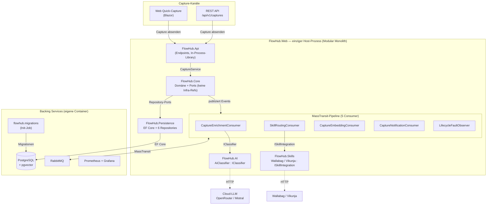
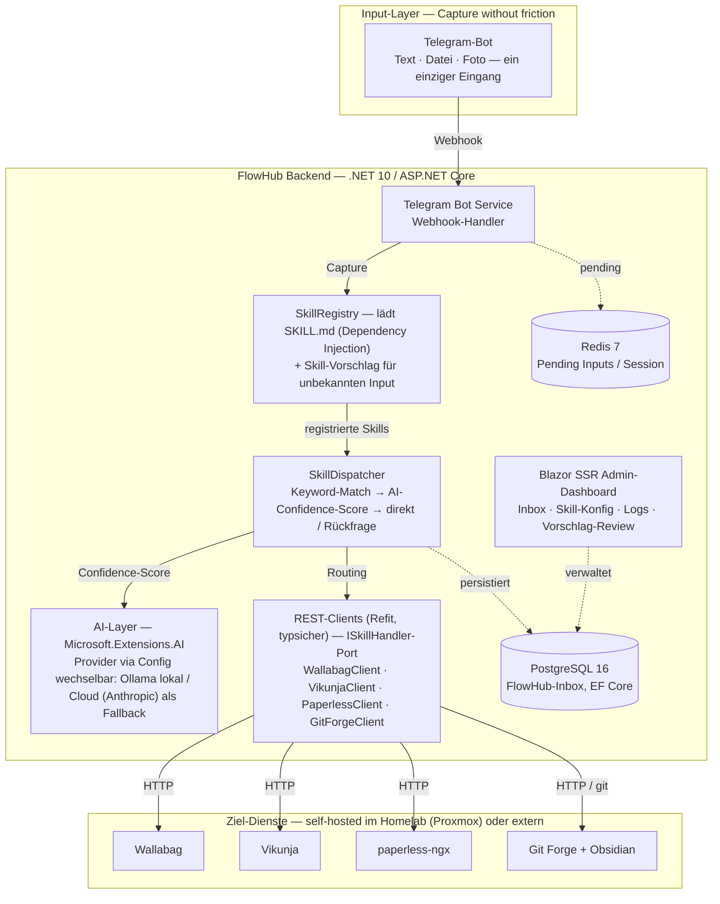

# FlowHub – Projektbeschreibung

**CAS AI-Assisted Software Engineering (AISE)**
W4B-C-AS001 · ZH-Sa-1 · FS26

**Student:** Andreas Imboden
**Datum:** Februar 2026

> 📑 **Navigation:** Das Inhaltsverzeichnis dieses PDFs liegt als
> **Lesezeichen / Outline** vor — im PDF-Viewer über die Seitenleiste erreichbar.

---

## 1. Vision

FlowHub ist eine KI-gestützte persönliche Inbox, die Informationsschnipsel aus dem Alltag automatisch erkennt, kategorisiert und an die richtigen Services weiterleitet.

Der digitale Alltag produziert ständig kleine Informationsfragmente: ein Film den man schauen möchte, ein Tech-Artikel zum Lesen, ein Foto eines Kassenbelegs. Heute landen diese Schnipsel verstreut in verschiedenen Apps, Chats oder werden schlicht vergessen.

FlowHub schafft einen einzigen Eingang für all diese Inputs und erledigt die Ablage automatisch – mit KI-Unterstützung und minimalem Aufwand für den Benutzer.

**KI-Nutzen je Kernfunktion:**

- **Erfassung:** Die KI ermöglicht die Ein-Schritt-Erfassung — der Benutzer muss im Moment des Capture nicht entscheiden, wohin die Information gehört.
- **Klassifikation:** Ein LLM erkennt Typ und Ziel-Skill jedes Schnipsels, mit deterministischem Keyword-Matching als Fallback.
- **Routing:** Profitiert direkt von der KI-Klassifikation — der passende Ziel-Dienst wird ohne Benutzer-Entscheid gewählt.
- **Anreicherung:** Das LLM ergänzt Titel, Tags und (bei Zitaten) Kontext, die der Benutzer sonst manuell setzen müsste.
- **Fallback & Retry:** Ist die KI-Klassifikation unsicher oder schlägt sie fehl, greift ein deterministischer Keyword-Floor; fehlgeschlagene Captures bleiben als Orphan retry-bar.

---

## 2. Stakeholder

**Primär: Homelab-Betreiber (Persona: Andreas)**

- Technisch versierter Anwender
- Betreibt Self-Hosted Services im Heimnetzwerk (Proxmox, Docker)
- Nutzt bereits: paperless-ngx, Passbolt, Git Forge, Vikunja, Wallabag
- Problem: Informationsschnipsel landen überall, kein einheitlicher Eingang
- Ziel: Schnelle, reibungslose Erfassung von Alltagsinformationen via Telegram

**Sekundär: Digital Hoarders**

- Sammeln Artikel, Bookmarks, Notizen in vielen Tools
- Frustriert durch manuelles Kategorisieren und Sortieren
- Würden von automatisierter Ablage profitieren

**Tertiär: CAS-Dozenten (FFHS)**

- Erwarten: Verteilte Web-Applikation mit KI-Einsatz
- Erwarten: Saubere Software-Architektur-Dokumentation
- Erwarten: Reflexion über KI-unterstützte Entwicklung

---

## 3. Kundenbedürfnis

Das adressierte Kernbedürfnis ist **"Capture without friction"**: Der Benutzer möchte eine Information festhalten, ohne in diesem Moment entscheiden zu müssen, wohin sie gehört und wie sie abgelegt wird.

**Heute:**

> Idee → Welche App? → App öffnen → Kategorisieren → Ablegen
> = 5+ Schritte, Kontextwechsel, oft vergessen

**Mit FlowHub:**

> Idee → Telegram Bot → Fertig
> = 1 Schritt, KI übernimmt den Rest

---

## 4. Externe Services

FlowHub integriert ausschliesslich Self-Hosted Services aus dem eigenen Homelab (kein Cloud-SaaS):

| Service | URL | Zweck |
|---|---|---|
| Vikunja | https://vikunja.io/ | Task-Management für Bücher, Filme/TV |
| paperless-ngx | https://docs.paperless-ngx.com/ | Dokumenten-Management-System (DMS) |
| Wallabag | https://wallabag.org/ | Read-Later Service für Artikel |
| Git Forge (Self-Hosted) | — | Repository mit Obsidian Markdown Files (Knowledge Base) |

---

## 5. Funktionsübersicht

### 5.1 Skill-System

FlowHub verwendet ein **Skill-basiertes Routing**: Jeder eingehende Input wird einem Skill zugewiesen, der die Ablage in den passenden Ziel-Service übernimmt. Die Erkennung erfolgt über Keywords, URL-Muster und – falls nötig – ein lokales LLM.

#### ArticleSkill – Artikel zum späteren Lesen (→ Wallabag)

Erkennung: URL von Nachrichtenportalen, Blogs, Fachzeitschriften

Beispiele:
- `https://www.heise.de/select/ct/2026/4/2533109542020998570`
- `https://www.heise.de/ratgeber/Fluechtige-SSH-Schluessel-mit-opkssh-und-OpenID-Connect-generieren-10639864.html`

---

#### HomelabSkill – Homelab-Services zum Ausprobieren (→ Vikunja)

Erkennung: URL von Software/Service-Websites; Keywords: homelab, ausprobieren, install, self-host, try

Beispiele:
- `https://adguard.com/de/welcome.html`
- `https://jellyfin.org/`

---

#### BookSkill – Bücher & IT-Bücher (→ Vikunja)

Erkennung: URL von Buchshops (exlibris, galaxus, amazon, orellfuessli); Keywords: buch, lesen, bestellen, isbn

Beispiele:
- `https://www.exlibris.ch/de/buecher-buch/english-books/linus-torvalds/just-for-fun/id/9780066620732/`
- `https://www.galaxus.ch/de/s18/product/eine-kurze-geschichte-der-menschheit-deutsch-yuval-noah-harari-2015-sachbuecher-7003551`

---

#### MovieSkill – Filme & TV-Serien (→ Vikunja)

Erkennung: Keywords: schauen, watch, film, movie, serie, TV; Google-Share-URLs (`share.google/...`)

Beispiele:
- `The Imitation Game – Ein streng geheimes Leben` + `https://share.google/1vwEtMUiRriic4nNi`
- `Star Trek` + `https://share.google/338RxCPCv9Ytm0wgA`

---

#### KnowledgeSkill – Knowledge Base Einträge (→ Obsidian via Git Forge)

Erkennung: Artikel-URL mit explizitem Wissensbasis-Kontext; Keywords: notiz, wissen, merken, knowledge, speichern

Beispiele:
- `https://www.heise.de/select/ct/2026/5/2532311091092661684`
- `https://www.heise.de/select/ct/2026/5/2534615175182620957`

---

#### DocumentSkill – Dokumente (→ paperless-ngx)

Erkennung: Dateianhang (PDF, Foto); Keywords: quittung, rechnung, beleg, dokument

Beispiele:
- Foto einer Quittung
- PDF einer Rechnung

---

#### QuoteSkill – Zitate mit KI-Anreicherung (→ Obsidian via Git Forge)

Erkennung: Keywords: zitat, quote, gesagt von; Anführungszeichen im Text; Share-Links auf Zitate

Enrichment via KI: Autor und AuthorInfo (Kontext, Werk, Biografie-Snippet) werden automatisch ergänzt

Beispiel:
- Shannons Zitat zur Informationstheorie: `https://g.co/gemini/share/917675e7a359`

---

#### GenericSkill – Fallback (→ FlowHub Inbox / PostgreSQL)

Greift wenn kein anderer Skill passt. Input landet in der Inbox zur späteren manuellen Klassifizierung.

---

#### Skill-Vorschlag bei unbekanntem Input

Wenn die Kategorisierung keinen bestehenden Skill zuweisen kann, schlägt das System dem Benutzer einen neuen Skill vor:

```
Bot: "Ich konnte diesen Input keinem Skill zuweisen.
      Möchtest du einen neuen Skill erstellen?
      [Ja, Skill erstellen] [In Inbox ablegen] [Verwerfen]"
```

Bei Bestätigung wird eine SKILL.md-Vorlage generiert und der Input zwischengespeichert. Der neue Skill kann anschliessend konfiguriert und aktiviert werden.

---

### 5.2 MVP – CAS Projektarbeit

Der MVP-Scope ist bewusst eng gefasst. Komplexität wird durch saubere Architektur beherrscht, nicht durch Featureumfang.

**Input-Kanal**

| Feature | Beschreibung | Status |
|---|---|---|
| Telegram Bot (Text) | Textnachrichten empfangen und verarbeiten | ✅ MVP |
| Telegram Bot (Datei/Foto) | Dateianhänge empfangen und verarbeiten | ✅ MVP |

**Skill-System (automatische Erkennung und Routing)**

| Skill | Erkennung | Ziel-Service | Status |
|---|---|---|---|
| ArticleSkill | URL (News/Blog/Fachmagazin) | Wallabag | ✅ MVP |
| HomelabSkill | URL (Software/Service) + Keywords | Vikunja | ✅ MVP |
| BookSkill | URL (Buchshop) + Keywords | Vikunja | ✅ MVP |
| MovieSkill | Keywords + Google-Share-URL | Vikunja | ✅ MVP |
| DocumentSkill | Dateianhang (Foto/PDF) | paperless-ngx | ✅ MVP |
| KnowledgeSkill | URL + Keywords | Obsidian (Git Forge) | Future |
| QuoteSkill | Keywords + Anführungszeichen | Obsidian (Git Forge) | Future |
| GenericSkill | Kein anderer Skill greift | FlowHub Inbox (PostgreSQL) | ✅ MVP |
| Skill-Vorschlag | Unbekannter Input → neuen Skill vorschlagen | – | Future |

**Ziel-Services (Integrationen)**

| Service | Typ | Integration | MVP-Umfang |
|---|---|---|---|
| Wallabag | Self-Hosted | REST API | URL speichern |
| Vikunja | Self-Hosted | REST API | Task/Item erstellen |
| paperless-ngx | Self-Hosted | REST API | Dokument hochladen |
| Obsidian / Git Forge | Self-Hosted | Git API | Markdown-Datei erstellen |
| FlowHub Inbox | Eigene DB | PostgreSQL | Fallback-Speicher |

**Benutzerinteraktion**

| Feature | Beschreibung | Status |
|---|---|---|
| Direkte Verarbeitung | Klarer Input → sofortige Aktion | ✅ MVP |
| Rückfrage mit Auswahl | Unklarer Input → Bot fragt mit 2–3 Optionen zurück | ✅ MVP |
| Bestätigungs-Feedback | Bot antwortet mit Ergebnis | ✅ MVP |
| Skill-Vorschlag | Unbekannter Input → neuen Skill vorschlagen | Future |

**KI-Integration**

| Feature | Beschreibung | Status |
|---|---|---|
| Keyword-basierte Erkennung | Zuverlässiger Fallback ohne KI-Kosten | ✅ MVP |
| Microsoft.Extensions.AI + Ollama | Lokales LLM für Skill-Erkennung | ✅ MVP (wenn Zeit reicht) |
| Confidence-Score | Schwellwert bestimmt ob Rückfrage nötig | ✅ MVP (wenn Zeit reicht) |
| Enrichment (QuoteSkill) | Autor, AuthorInfo via KI ergänzen | Future |

### 5.3 Future – Spätere Versionen (nach CAS)

Diese Features sind architekturell vorbereitet, werden aber nicht für die Abgabe implementiert. Sie belegen die Zukunftsfähigkeit der Architektur.

**Erweiterte Skill-Funktionalität**

| Skill | Erweiterung |
|---|---|
| MovieSkill | IMDB/OMDB Metadaten (Titel, Rating, Jahr, Genre) |
| ArticleSkill | Zusätzlich: Obsidian-Notiz mit KI-Summary erstellen |
| DocumentSkill | AI OCR-Analyse (Betrag, Datum, Händler, Tags) |
| QuoteSkill | Vollständige Enrichment-Pipeline: Autor, Werk, Kontext |
| KnowledgeSkill | RAG-Integration: Obsidian als Wissensbasis für den Assistenten |
| Skill-Vorschlag | Automatische SKILL.md-Generierung via KI |

**Erweiterte Integrationen**

| Service | Erweiterung |
|---|---|
| Obsidian / Git Forge | RAG-Quelle für den Assistenten |
| paperless-ngx | AI-gestützte Tagging und Metadaten-Extraktion |
| Vikunja | Erweiterte Metadaten (Cover, Rating, Genre für Filme/Bücher) |

**Erweiterte KI-Features**

| Feature | Beschreibung |
|---|---|
| Lerneffekt | Nutzerverhalten verbessert Confidence über Zeit |
| RAG | Obsidian als Wissensbasis für den Assistenten |
| Enrichment | Automatische Anreicherung von Quotes, Büchern, Filmen |

**Weitere Input-Kanäle**

| Kanal | Beschreibung |
|---|---|
| Email | Emails als Input verarbeiten |
| Web Upload | Browser-Extension oder Web-UI für Uploads |
| API | Direkte REST-API für Drittanwendungen |

**Deployment-Evolution**

| Phase | Beschreibung |
|---|---|
| Phase 1 (MVP) | Docker Compose auf Proxmox Homelab |
| Phase 2 (Future) | Migration zu k3s (Kubernetes) |

---

## 6. Systemarchitektur

### 6.1 Überblick

> **Hinweis — Konzept-/Zielarchitektur, nicht Abgabestand.** Das folgende
> Übersichtsbild zeigt die *angestrebte* Gesamtarchitektur und enthält bewusst
> auch noch **nicht implementierte** Bausteine (z. B. Ollama-LLM, Telegram-Kanal,
> Redis). Die tatsächlich gebaute, als-built-Architektur ist der **Modular
> Monolith** aus sechs Projekten mit MassTransit-Pipeline — maßgeblich sind dafür
> die C4-/Hexagonal-Diagramme in `docs/design/perspectives.md`, das
> ER-Diagramm in `docs/design/db/er.md` und die ADRs (insb. ADR 0002/0003/0005,
> jeweils mit „As built"-Notiz). Siehe auch `docs/spec/system-context.md`
> → „Current state (Block 5)".

**Ist-Architektur (Block 5, as built)** — der tatsächlich gebaute Modular Monolith:



**Zielbild (Konzeptphase)** — enthält noch nicht gebaute Bausteine:



**Skill → Ziel-Dienst (Konzept):**

| Skill | Ziel-Dienst |
|---|---|
| `ArticleSkill` | Wallabag |
| `HomelabSkill` · `BookSkill` · `MovieSkill` | Vikunja |
| `DocumentSkill` | paperless-ngx |
| `KnowledgeSkill` · `QuoteSkill` | Obsidian / Git Forge |
| `GenericSkill` | Inbox (PostgreSQL) |

_Konzept-Stand Februar 2026 · Andreas Imboden — Services self-hosted auf Proxmox, Cloud-LLM als KI-Fallback, Docker-Compose-Deployment. Maßgeblich für den Abgabestand ist die **Ist-Architektur** oben._


### 6.2 Hybrid Skill-System (Kernarchitektur)

FlowHub verwendet einen **Hybrid-Ansatz** für das Skill-System, der Code und Konfiguration kombiniert:

**`SKILL.md`** (Deklarativ, versioniert):

```yaml
---
name: article-skill
description: Saves articles for later reading to Wallabag
handler: FlowHub.Skills.Handlers.ArticleSkillHandler
metadata:
  flowhub:
    triggers:
      keywords: [artikel, lesen, read later, später lesen]
      urlPatterns: [heise.de, ct.de, arstechnica.com]
    config:
      wallabag_tag: flowhub
---
# Dokumentation des Skills (für Menschen und KI lesbar)
```

**`ArticleSkillHandler.cs`** (Business-Logic, typsicher):

```csharp
public class ArticleSkillHandler : ISkillHandler
{
    private readonly IWallabagClient _wallabag;

    public ArticleSkillHandler(IWallabagClient wallabag)
    {
        _wallabag = wallabag;
    }

    public async Task<SkillResult> ExecuteAsync(InputItem input, SkillConfig config)
    {
        await _wallabag.SaveEntryAsync(input.Url, config.WallabagTag);
        return new SkillResult { Success = true };
    }
}
```

**Vorteile dieses Ansatzes:**

- Konfiguration ohne Neustart änderbar (`SKILL.md`)
- Typsichere Business-Logic (C#)
- Selbstdokumentierend (Markdown human readable)
- Zukunftsfähig: KI kann `SKILL.md` Files lesen und generieren

> **Umsetzungshinweis (Stand der Implementierung).** Der oben skizzierte
> deklarative `SKILL.md`-Loader stammt aus der **Konzeptphase (Februar 2026)**.
> In der Umsetzung wurde das Skill-System bewusst vereinfacht: Skills sind
> kompilierte **`ISkillIntegration`-Adapter** (ein Adapter je Ziel-Dienst), die
> der `SkillRoutingConsumer` per `Name` auflöst. Die `SkillRegistry`
> (`EfSkillRegistry`) hält Skill-**Metadaten** für Health/UI — sie lädt **keine**
> `SKILL.md`-Dateien zur Laufzeit.
>
> **Warum kein deklarativer Loader:** Die Kommunikation mit dem Ziel-Dienst lebt
> im Adapter selbst — HTTP-Pfad, Auth-Schema, Payload-Mapping und Response-Parsing
> (z. B. `VikunjaSkillIntegration`: `PUT /api/v1/projects/{id}/tasks` mit
> Bearer-Token; Wallabag: OAuth-Token-Refresh; Paperless: Dokument-Upload). Diese
> dienst­spezifische Integrationslogik ist nicht deklarierbar, sie bleibt
> zwingend Code. Eine `SKILL.md` könnte nur Trigger + Konfiguration beschreiben;
> der typisierte Handler wäre weiterhin nötig — der deklarative Teil brachte also
> kaum Mehrwert und wurde zugunsten eines einfacheren, vollständig getesteten
> Routings descoped. Ein neuer Skill wird über eine Adapter-Klasse +
> DI-Registrierung ergänzt.
>
> Begründung des Scopings: **ADR 0002**; die gebaute Architektur steht in
> **Arc42 v2 (as built)**. Der laufzeit-deklarative Ansatz lebt als Roadmap-Idee
> **„Marketplace for Skills"** weiter.

### 6.3 Technologie-Stack

| Schicht | Technologie | Begründung |
|---|---|---|
| Backend | .NET 10 / C# / ASP.NET Core | LTS-Release Nov. 2025, vertrauter Stack, hohe Performance |
| Web-UI | Blazor SSR (Server-Side Rendering) | .NET-native, kein JS-Framework nötig, SEO-freundlich |
| KI-Integration | Microsoft.Extensions.AI + Ollama / Anthropic SDK | Abstraktion über LLM-Provider, Ollama: lokal & kostenlos |
| Datenbank | PostgreSQL 16 | Bewährt, EF Core Integration |
| Cache/State | Redis 7 | Session-State, Pending Inputs |
| API-Framework | ASP.NET Core Minimal APIs | Schlank, performant, .NET-nativ |
| REST Clients | Refit | Typsicher, deklarativ, Interface-basiert |
| ORM | Entity Framework Core 10 | .NET-Standard, Code-First Migrations |
| Telegram | Telegram.Bot (NuGet) | Offiziell unterstützte .NET-Library |
| Deployment | Docker Compose | Einfach, Proxmox-kompatibel |

### 6.4 Infrastruktur (Proxmox Homelab)

```
Proxmox VE
+-- VM: Docker Host
|   +-- FlowHub Backend (.NET 10)
|   +-- PostgreSQL
|   +-- Redis
|   +-- Ollama (Llama 3.x)
|
+-- VM/LXC: Wallabag        (Self-Hosted Read-Later)
+-- VM/LXC: paperless-ngx   (bereits vorhanden)
+-- VM/LXC: Vikunja         (Task-Management / Kanban)
+-- VPS (extern, DE):
    +-- Git Forge           (Obsidian Markdown Repo)

Cloud:
+-- Anthropic API           (Claude, Fallback für KI)
```

---

## 7. Architekturentscheidungen (ADR)

Dieses Kapitel listet die **frühen Plattform- und Strategie-Entscheidungen** aus der Konzeptphase (vor Block 1). Sie definieren den Rahmen für die spätere Implementierung. Während der Umsetzung sind sechs **lightweight Implementation-ADRs** (Context → Decision → Consequences) im Repository unter [`docs/adr/`](https://github.com/freaxnx01/FlowHub-CAS-AISE/tree/main/docs/adr) entstanden, die dort einzeln einsehbar sind:

| ADR | Titel | Status |
|---|---|---|
| [0001](https://github.com/freaxnx01/FlowHub-CAS-AISE/blob/main/docs/adr/0001-frontend-render-mode-and-architecture.md) | Frontend Render Mode and Architecture | Accepted |
| [0002](https://github.com/freaxnx01/FlowHub-CAS-AISE/blob/main/docs/adr/0002-service-architecture-and-async-communication.md) | Service Architecture and Async Communication | Accepted |
| [0003](https://github.com/freaxnx01/FlowHub-CAS-AISE/blob/main/docs/adr/0003-async-pipeline.md) | Async Pipeline (MassTransit) | Accepted |
| [0004](https://github.com/freaxnx01/FlowHub-CAS-AISE/blob/main/docs/adr/0004-ai-integration-in-services.md) | AI Integration — Provider Abstraction (MEAI) | Accepted |
| [0005](https://github.com/freaxnx01/FlowHub-CAS-AISE/blob/main/docs/adr/0005-persistence.md) | Persistence — EF Core + PostgreSQL | Accepted |
| [0006](https://github.com/freaxnx01/FlowHub-CAS-AISE/blob/main/docs/adr/0006-vector-search.md) | Vector Search — pgvector + Mistral Embeddings | Accepted |

Die nachfolgenden Einträge **PE-1 bis PE-7** (Plattform-Entscheidungen) sind bewusst von den Implementation-ADRs entkoppelt — sie sind Strategie, nicht Lösungsstruktur.

### PE-1: C# / .NET 10 als primäre Sprache und Plattform

**Entscheidung:** C# mit .NET 10 als primäre Sprache.

**Begründung:**
- Vertrauter Stack aus dem beruflichen Hintergrund (geringere Lernkurve)
- .NET 10 als aktueller LTS-Release (erschienen November 2025) mit langfristigem Support
- Starkes Ökosystem: EF Core, ASP.NET Core, Refit, Blazor – alles aus einem Guss
- Null-Safety via Nullable Reference Types (C# 8+)
- In der PVA explizit bestätigt: freie Wahl des Technologie-Stacks

**Konsequenz:** Kein Wechsel zu Quarkus/Kotlin nötig; vorhandenes C#-Wissen direkt produktiv einsetzbar.

### PE-2: Blazor SSR für das Web-Dashboard

**Entscheidung:** Blazor Server-Side Rendering (SSR) für die Admin-Ansicht.

**Begründung:**
- .NET-native, kein separates JavaScript-Framework (React, Angular, Vue) nötig
- SSR liefert fertig gerendertes HTML – schnell, SEO-freundlich, kein WASM-Download
- Komponenten-Modell vertraut aus dem .NET-Ökosystem
- Volle C#-Typsicherheit auch im Frontend

**Konsequenz:** Blazor SSR eignet sich optimal für das Admin-Dashboard; für komplexe interaktive Elemente kann Blazor Interactive Server Mode ergänzt werden.

### PE-3: Hybrid Skill-System (SKILL.md + C# Handler)

**Entscheidung:** Kombination aus deklarativer Konfiguration (`SKILL.md`) und typsicherer Business-Logic (C#).

**Begründung:**
- Pure Code: Gut testbar, keine Runtime-Konfiguration
- Pure Config: Flexibel, aber keine Typsicherheit
- Hybrid: Best of Both Worlds

**Konsequenz:** Zwei Artefakte pro Skill (`SKILL.md` + Handler), aber maximale Flexibilität.

> **Abweichung in der Umsetzung.** Realisiert wurde nur die typsichere Hälfte:
> ein **`ISkillIntegration`-Adapter** je Skill, der die gesamte
> Ziel-Dienst-Kommunikation (HTTP, Auth, Payload-Mapping) kapselt. Genau diese
> Integrationslogik ist nicht deklarierbar — sie bleibt zwingend Code; eine
> `SKILL.md` hätte den Handler nicht ersetzt, sondern nur ergänzt. Der
> laufzeit-deklarative `SKILL.md`-Teil wurde deshalb zugunsten eines einfacheren,
> vollständig getesteten Routings descoped (→ **ADR 0002**, **Arc42 v2**) und lebt
> als Roadmap-Idee **„Marketplace for Skills"** weiter. Details siehe
> Umsetzungshinweis in Abschnitt 6.2.

### PE-4: Docker Compose jetzt, k3s als Future Option

**Entscheidung:** Docker Compose für MVP-Deployment.

**Begründung:**
- Schnellerer Start (1 Tag Setup vs. 1 Woche k8s)
- Einfacheres Debugging während Entwicklung
- Passt zu FFHS Block 5 Timeline (k8s im Juni)
- App ist von Beginn an k8s-ready (12-Factor, Health Checks, Stateless)

**Konsequenz:** Migration zu k3s als Block 5 Projekt möglich, ohne Code-Änderungen.

### PE-5: Ollama (lokal) als primäres LLM

**Entscheidung:** Llama 3.x via Ollama lokal, Anthropic API als Fallback.

**Begründung:**
- Ollama: Kostenlos, privat, offline-fähig
- Anthropic API: ~$6/Monat für Homelab-Nutzung, nur für hochwertige Aufgaben
- `Microsoft.Extensions.AI`: Provider-Wechsel nur via Config, kein Code-Änderung

**Konsequenz:** 4.7 GB Model-Download, 4 GB RAM Bedarf für Ollama.

### PE-6: paperless-ngx für Dokumenten-MVP als reines Upload-Ziel

**Entscheidung:** Im MVP fungiert paperless-ngx als Dokumenten-Archiv ohne KI-Analyse.

**Begründung:**
- Fokus auf funktionierende Grundstruktur, nicht Feature-Tiefe
- OCR und Metadaten-Extraktion sind komplex (separates Lernziel)
- paperless-ngx hat eigene gute Basis-Kategorisierung via Regeln

**Konsequenz:** DocumentSkill macht nur: Erkennen → Upload. Keine Tags, keine Metadaten-Extraktion im MVP.
**Future:** KI-gestützte Analyse des OCR-Texts (Betrag, Datum, Händler) via `Microsoft.Extensions.AI`.

### PE-7: Kein Cloud-SaaS – ausschliesslich Self-Hosted Services

**Entscheidung:** Alle Ziel-Services laufen Self-Hosted im Homelab. Todoist (Cloud SaaS) wird nicht integriert.

**Begründung:**
- Datensouveränität: Alle persönlichen Daten bleiben im eigenen Homelab
- Kostenfreiheit: Keine laufenden SaaS-Gebühren
- Vikunja ersetzt Todoist vollständig für Task/Item-Management und übernimmt auch die Kanban-Sicht für Homelab-Services

**Konsequenz:** Alle 4 Ziel-Services (Wallabag, Vikunja, paperless-ngx, Git Forge) sind Self-Hosted auf Proxmox.

---

## 8. CAS-Kursstruktur und Projektfortschritt

**Mapping: FFHS Blöcke → FlowHub Entwicklung**

| Block | Datum | FFHS Thema | FlowHub Deliverable |
|---|---|---|---|
| 1 | Feb 21 | Konzeption, Einführung | ✅ Projektbeschreibung, Architekturentwurf, ADRs |
| 2 | Mär 21 | Frontend, Web-Präsentation | Telegram Bot UI, Blazor SSR Dashboard (Admin-Ansicht) |
| 3 | Apr 25 | Services, REST, MCP | Skill-System, REST Clients via Refit (Wallabag, Vikunja, paperless) |
| 4 | Mai 23 | Persistence, Datenbanken | PostgreSQL Schema via EF Core, Redis State, Repository-Pattern |
| 5 | Jun 20 | Docker, Kubernetes | Docker Compose finalisiert, optional: k3s Migration |
| Abgabe | Jul 6 | – | Vollständiges MVP + Dokumentation + Git-Repository |

---

## 9. KI-Einsatz in der Entwicklung (Reflexion)

**Detaillierte Auswertung pro Block / Slice:** `docs/ai-usage.md` (531 Zeilen, gegliedert pro Block mit *generated-vs-handwritten*-Tabellen, Korrektur-Geschichten und Reflexion). Dieser Abschnitt fasst die Erkenntnisse über alle fünf Blöcke zusammen.

### KI-Tools im Entwicklungsprozess

| Werkzeug | Einsatzbereich |
|---|---|
| Claude Code (Opus 4.7, 1M-Kontext) | Brainstorming, Spec/Plan-Erstellung, ADR-Drafts, Controller für Subagent-Dispatches |
| Claude Sonnet 4.6 (Subagents) | Implementer + Spec-Reviewer + Code-Quality-Reviewer unter dem `superpowers:subagent-driven-development`-Workflow |
| Claude Haiku 4.5 (Subagents) | Mechanische Tasks (csproj/Markdown/YAML), ca. 60 % Token-Ersparnis gegenüber Sonnet |
| `/ultrareview` (Multi-Agent Branch-Review) | Architektonisches Review über ganzen Feature-Branch — fängt System-Invarianten ab, die Per-Task-Review nicht sieht |
| Microsoft.Extensions.AI + Anthropic/OpenRouter | KI im Produkt (Classifier, Quote-Enricher, Embeddings) |
| Eigenentwickelte CAS-Skills | `cas-aise-todo-list`, `cas-aise-grade-self-check`, `sync-ai-instructions` — Rubrik-Verankerung, Block/Phase-Steuerung, Cross-Project-Reuse |

### Workflow-Entwicklung (Block 1 → Block 5)

Mit jedem Block wurde ad-hoc Chat gegen strukturierteren, isolierteren Subagent-Dispatch getauscht. Der Mehraufwand für Struktur hat sich durch weniger Mid-Task-Eskalationen und seltenere "Agent ist abgedriftet"-Momente bezahlt gemacht.

| Block | Workflow-Verschiebung |
|---|---|
| 1 — Einführung | Ad-hoc Claude.ai-Chat für Architektur; Copilot inline für Code. |
| 2 — Frontend | Erster sustained Claude-Code-CLI-Einsatz mit phasenbasierter Disziplin (`/ui-brainstorm` → `/ui-flow` → `/ui-build` → `/ui-review`). |
| 3 — Service | Erster vollständiger `superpowers:brainstorming` → `writing-plans` → `subagent-driven-development`-Slice. Zweistufiges Review (Spec + Quality) pro Task. |
| 4 — Persistence | Sonnet als Default, Haiku für Mechanik; Per-Task-Quality-Review fallen gelassen zugunsten einer Branch-Review am Slice-Ende — ca. 60 % Token-Burn reduziert ohne Qualitätsverlust. |
| 5 — Deployment | `/ultrareview` (Multi-Agent Branch-Review) und rubrik-gegroundetes `cas-aise-grade-self-check` ergänzt; jede Block-Abschluss-Prüfung läuft durch die Skill. |

Bis Block 5 verantworten Implementer-Subagents ganze Slices end-to-end. Die menschliche Arbeit konzentriert sich an zwei Stellen: **Spec** (wo Verträge festgenagelt werden) und **Review** (wo System-Invarianten geprüft werden). Der Engpass wandert vom Tippen zu diesen beiden Punkten.

### Wiederkehrende Fehlerquellen

1. **Single-Pass-AI-Review übersieht System-Invarianten.** Block-5-Beispiel: AI-generierter Code, der Embedding-Generation in `EfCaptureService.SubmitAsync` integrierte, war lokal korrekt (eine Transaktion) — global aber falsch, weil ein langsamer Provider das NfA-09 p95 < 200 ms Submit-Budget sprengt. Per-Task-Quality-Review konnte das nicht fangen; `/ultrareview` wurde dafür eingeführt und hat es beim ersten Lauf gefunden.
2. **Deployment-Shape-Failures sind systematisch unter-getestet.** Compose-`${X:-}`-Interpolation substituiert leere Strings (nicht null), wodurch `??`-Defaults still no-op'en. `.editorconfig` nicht in den Docker-Build-Kontext kopiert → Analyzer-Suppressions werden zu Build-Errors. Casing-Mismatch `EMBEDDINGS__APIKEY` vs. `Embeddings__ApiKey` schaltete ein ganzes Feature aus. Fünf solcher Defekte in einem Nachmittag durch `just smoke-prod` gefangen.
3. **Training-Data-Lag bei aktuellen Libraries.** `Pgvector.EntityFrameworkCore` wurde als in-the-box-Npgsql-10-Feature angenommen (ist aber ein separates Paket). `MassTransit.Testing` wurde als separates Paket angenommen (ist Teil der Haupt-Assembly). API-Behauptungen der KI müssen mechanisch gegen das tatsächlich installierte Paket verifiziert werden.
4. **Offene Prompts inflationieren den Scope.** "Füge X hinzu" ohne Plan produziert eine Feature-Suite. Das Gegenmittel war `superpowers:writing-plans` — kleinteilige TDD-geordnete Tasks mit vollständigem Inline-Code, exakten Pfaden und Commit-Messages. Subagents gegen wohldefinierte Tasks meldeten DONE; Subagents gegen offene Prompts gingen explorieren.
5. **Pläne aus unvollständigem Repo-Wissen.** Block-3-Slice-B-Plan übersah `CaptureServiceStubTests.cs` und die existierenden `ChannelKind`-Werte; Implementer mussten mid-Task adaptieren. Brainstorming/Planning liest seitdem jede referenzierte Datei *bevor* der Plan eingefroren wird.

### Wiederkehrende Stärken

1. **Der Plan ist der Vertrag.** Enthält der Plan exakte Pfade, exakten Code, exakte Commit-Messages und exakte Verifikationskommandos, operiert der Implementer mit engem Judgment-Spielraum und meldet DONE statt NEEDS_CONTEXT. Die 95 %+ "AI-drafted"-Anteile im Produktionscode sind nur deshalb erreichbar.
2. **Review-Kadenz muss zur Fehlerklasse passen.** Per-Task-Spec + Per-Task-Quality war für Block 3 Slice B richtig (erster SDD-Lauf). Ab Block 4 fing Per-Task-Quality nichts Neues mehr, während ein Branch-weiter `/ultrareview` am Slice-Ende genau die Architektur-Fehler fand, die Per-Task-Review nicht sehen konnte.
3. **Eigene Skills als Memory-Layer des Projekts.** `cas-aise-todo-list`, `cas-aise-grade-self-check`, `sync-ai-instructions` decken Concerns ab, die das Upstream-`superpowers`-Plugin nicht behandelt: Rubrik-Verankerung, kalender-getriebene Priorisierung, Cross-Project-Instruction-Reuse. Ohne `cas-aise-grade-self-check` driftete die Rubrik-Abdeckung in langen Sessions — die Skill fand fehlende Evidenz in genau dieser Reflexion vor Abgabe.
4. **KI für rigide-Struktur-Artefakte, Mensch für architektonisches Urteil.** GitHub-Actions-YAML, ADR-Scaffolds, OpenAPI-ProblemDetails, EF-Migrationen — rigide Strukturen, in denen der 90-%-korrekte AI-Erstwurf reale Zeit spart. Architektur-Entscheidungen (hexagonaler Split für AI, In-Process vs. RabbitMQ Transport, Dispatcher-Event-Carries-Description vs. Inline-Skill-Call) bleiben beim Menschen; die KI listet Alternativen, sie wählt nicht.
5. **Korrektur-Geschichten sind die Rubrik-Evidenz, die zählt.** `docs/insights/block-5.md` "Defects Found by the Smoke Run" und die "Ultrareview-driven correction" / "Smoke-driven correction"-Sektionen in `docs/ai-usage.md` sind auditierbar: konkreter Defekt, fixender Commit, Lehre. Pauschale "KI hat geholfen"-Aussagen schliessen keinen Rubrik-Loop; "KI produzierte X, Smoke fing Y, Fix landete in Commit Z" schliesst ihn.

### Was ich anders machen würde

- **Rubrik-Verankerung ab Block 1, nicht Block 3.** `cas-aise-grade-self-check` entstand mittendrin; Block 1–2 hatten keine formalen `use-cases.md` / `nfa.md` / `acceptance-criteria.md`. Retroaktive Doku-Arbeit in spätem Block 3 / frühem Block 4 kostete reale Zeit.
- **`/ultrareview` ab Block 3, nicht Block 5.** Branch-weites Multi-Agent-Review fängt die Klasse von Architektur-Fehlern, die Per-Task-Review nicht sieht. Günstiger nach Slice B als nach einem 21-Task-Beta-MVP.
- **Ein `just smoke`-Rezept pro Block, nicht nur Block 5.** Fünf latente Bugs in einem Nachmittag durch `just smoke-prod`. Ein einfacheres Smoke (App booten, Feature-Pfad curlen) hätte mindestens drei davon früher gefangen.
- **`InternalsVisibleTo`- und EF-Core-Test-Host-Pattern im Plan-Template kodifizieren.** Block 3 Slice D und Block 4 hatten beide Implementer, die bei Compile-Errors per Default Sichtbarkeit aufweiteten. Das richtige Pattern ist mechanisch — sobald im Plan ausgeschrieben verschwindet die Friktion.

### Hat die Ausgangshypothese gestimmt?

Die Block-1-Annahme war: Claude ist "ein schneller Tipper mit guter Library-Kenntnis" — nützlich für Boilerplate, suspekt bei Architektur, im Wesentlichen ein Produktivitäts-Multiplikator und keine Workflow-Änderung. Bis Block 5 ist das in beide Richtungen weit daneben.

**Boilerplate ist schneller als erwartet.** Praktisch 100 % des Produktionscodes wurde KI-generiert (rund 5 % menschliche Nacharbeit) — das ist nicht "KI hat die ganze Arbeit gemacht": die 5 % Menschen-Input konzentrieren sich auf High-Judgment-Punkte (Scope, Verträge, Trade-offs). Das eigentliche Tippen ist aber wirklich ein kleiner Bruchteil der verstrichenen Zeit. Der Engpass wandert von der Implementation zu Spec und Review — exakt die Umkehrung, auf die SDD optimiert.

**Architektur ist gefährlicher als erwartet.** Der Embedding-on-Submit-Fall ist ein Ein-Absatz-Rewrite, der im Nachhinein offensichtlich ist: KI produzierte lokal korrekten Code, der eine System-Invariante brach, und ein Single-Pass-Review hätte ihn ausgeliefert. Die Deployment-Shape-Failures haben die gleiche Form: lokal korrekt, global falsch. Die menschliche Rolle an der Architektur-Grenze ist nicht geschrumpft, sie ist gewachsen — weil der Agent jetzt genug Code schnell genug produziert, dass nur noch der Filter an Design und Review Sinn ergibt.

KI hat keine Rolle im Workflow ersetzt. Sie hat verschoben, welche Rolle der Engpass ist. Für das nächste Projekt: zuerst die Spec-Dokumente, `/ultrareview` ab Tag eins, ein Smoke-Target vor dem ersten Feature. Implementations-Durchsatz ist nicht mehr die Beschränkung — Design- und Review-Durchsatz sind es.

---

## 10. Abgrenzung: Was FlowHub nicht ist

- ❌ Kein allgemeiner Chatbot – FlowHub hat eine klar definierte Aufgabe
- ❌ Kein Ersatz für paperless-ngx / Vikunja / Wallabag – FlowHub ergänzt, ersetzt nicht
- ❌ Kein IFTTT/n8n Clone – FlowHub ist code-basiert, nicht no-code
- ❌ Keine Multi-User-Plattform – Single-User Homelab-Tool
- ❌ Keine Cloud-Abhängigkeiten – ausschliesslich Self-Hosted

---

## 11. Risiken und Mitigationen

| Risiko | Wahrscheinlichkeit | Mitigation |
|---|---|---|
| Scope Creep (zu viele Skills) | Hoch | Klare MVP-Liste, Future klar abgegrenzt |
| Blazor SSR Lernkurve | Niedrig | Bekanntes C#-Ökosystem; gute Microsoft-Dokumentation |
| Ollama zu langsam (kein GPU) | Mittel | Claude API als Fallback; Keyword-Detection als Basis |
| Telegram API Änderungen | Niedrig | Abstraktion via ISkillHandler Interface |
| Vikunja API-Änderungen | Niedrig | Refit-Abstraktion, versionierte API-Clients |
| Zeitdruck (Abgabe Juli) | Mittel | MVP bewusst schlank, Future Features dokumentiert |

---

## 12. Glossar

| Begriff | Bedeutung |
|---|---|
| Skill | Handler für einen bestimmten Input-Typ (z.B. ArticleSkill) |
| SKILL.md | Konfigurationsdatei eines Skills (YAML Frontmatter + Markdown) |
| ISkillHandler | C# Interface mit der Business-Logic eines Skills |
| SkillRegistry | Lädt alle SKILL.md Files und zugehörige Handler |
| Skill-Vorschlag | Feature: System schlägt neuen Skill vor wenn kein bestehender passt |
| Pending Input | Input der auf Benutzer-Bestätigung wartet (in Redis) |
| Confidence | Wie sicher die KI bei der Skill-Erkennung ist (0.0–1.0) |
| Enrichment | KI-gestützte Anreicherung (z.B. Autor/AuthorInfo bei QuoteSkill) |
| Homelab | Selbst betriebene Server-Infrastruktur zu Hause (Proxmox) |
| Blazor SSR | Server-Side Rendering mit Blazor (.NET); HTML wird serverseitig gerendert |
| EF Core | Entity Framework Core – .NET ORM für Datenbankzugriffe |
| Refit | Typsichere REST-Client-Library für .NET (deklarativ via Interfaces) |
| M.E.AI | Microsoft.Extensions.AI – Abstraktion für LLM-Provider in .NET |
| Vikunja | Self-Hosted Task-Management / Kanban (ersetzt Todoist) |
| Wallabag | Self-Hosted Read-Later Service für Artikel |
| Knowledge Base | Obsidian Markdown Files, versioniert in Git Forge (Self-Hosted) |

---

*Erstellt mit Unterstützung von Claude (Anthropic) – gemäss FFHS Richtlinien für KI-Einsatz in Projektarbeiten.*
