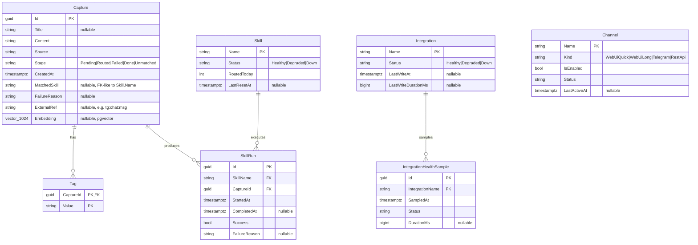

# Database Model

PostgreSQL schema for FlowHub. EF Core code-first; entities under [`source/FlowHub.Persistence/Entities/`](../../source/FlowHub.Persistence/Entities), per-entity `EntityTypeConfiguration` classes encapsulate column types, indexes, and relationships. The authoritative snapshot lives in [`FlowHubDbContextModelSnapshot.cs`](../../source/FlowHub.Persistence/Migrations/FlowHubDbContextModelSnapshot.cs). Design rationale is in [ADR 0005 — Persistence](../adr/0005-persistence.md). Vector search columns and indexes are introduced in [ADR 0006 — Vector Search](../adr/0006-vector-search.md).

## Entity-relationship diagram

> `Channel` has no foreign-key relationship to `Capture` — channel attribution is denormalised onto `Capture.Source` (string) for simpler queries and lower join cost. `Channel` rows are the configurable enable/disable + health surface for each input route.

## Tables — column summary

| Table | PK | Notable columns | Notes |
|---|---|---|---|
| `Captures` | `Id` (uuid) | `Stage`, `CreatedAt`, `MatchedSkill`, `Embedding` (`vector(1024)`) | Core entity. `Embedding` populated post-classification; null until first AI pass. |
| `Tags` | (`CaptureId`, `Value`) | — | Composite key; cascades on Capture delete. |
| `Skills` | `Name` (text) | `Status`, `RoutedToday`, `LastResetAt` | Seeded from migration; `RoutedToday` reset by background job at UTC midnight. |
| `SkillRuns` | `Id` (uuid) | `SkillName` FK, `CaptureId` FK, `Success`, `StartedAt` | Append-only run history. Indexed on `(CaptureId, StartedAt DESC)`. |
| `Integrations` | `Name` (text) | `Status`, `LastWriteAt`, `LastWriteDurationMs` | Configurable external systems (Wallabag, Vikunja, …). |
| `IntegrationHealthSamples` | `Id` (uuid) | `IntegrationName` FK, `SampledAt`, `Status` | Time-series; 90-day retention enforced via cron job. |
| `Channels` | `Name` (text) | `Kind`, `IsEnabled`, `Status`, `LastActiveAt` | Capture-input routes; no FK to `Captures` (denormalised). |

## Index strategy

See [NfA-P2 — Index Coverage](nfa.md#nfa-p2-index-coverage) for the complete list. In brief:

- `IX_Captures_Stage` — dashboard "Needs Attention", lifecycle filters
- `IX_Captures_CreatedAt_DESC` — recent-captures list, cursor pagination
- `IX_Captures_MatchedSkill` — skill-routed queries
- `IX_Captures_Embedding` — HNSW (`vector_cosine_ops`) for semantic search (ADR 0006)
- `IX_IntegrationHealthSamples_IntegrationName_SampledAt_DESC` — health history per integration
- `IX_SkillRuns_CaptureId_StartedAt_DESC` — per-Capture run history
- `IX_Tags_Value` — tag filter on the Captures list

## Migrations

Migrations live under [`source/FlowHub.Persistence/Migrations/`](../../source/FlowHub.Persistence/Migrations). Production application is done via a dedicated init container (`flowhub.migrations` in `docker-compose.yml`) running `dotnet ef migrations bundle`, per NfA-O3. Dev convenience: the `MigrationRunner` hosted service auto-applies on startup when `ASPNETCORE_ENVIRONMENT=Development`.

The pgvector extension is enabled via a raw SQL migration step before any `Captures.Embedding` column is created.
