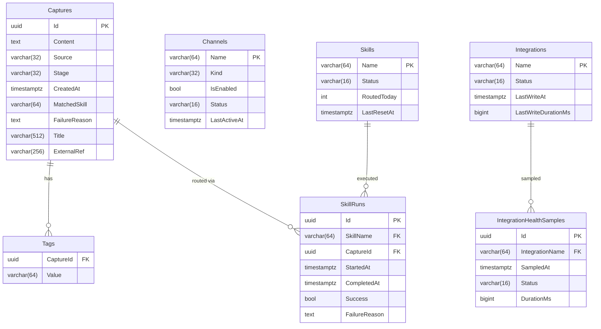

# Block 4 — Slice 3: Full Domain Model (May 18–25)

**Rubric targets:** DB-Modell (3), Intelligente Services (6 complete), Code strukturiert (7 complete), Erkenntnisse (partial 3)

**Prerequisites:** Slice 2 complete. `make db-migrate` has applied 0002_AddChannelAndSkill.

---

### Task 8: Integration + IntegrationHealthSample Entities

**Files:**
- Create: `source/FlowHub.Core/Health/IIntegrationRepository.cs`
- Create: `source/FlowHub.Persistence/Entities/IntegrationEntity.cs`
- Create: `source/FlowHub.Persistence/Entities/IntegrationEntityTypeConfiguration.cs`
- Create: `source/FlowHub.Persistence/Entities/IntegrationHealthSampleEntity.cs`
- Create: `source/FlowHub.Persistence/Entities/IntegrationHealthSampleEntityTypeConfiguration.cs`
- Create: `source/FlowHub.Persistence/Repositories/EfIntegrationRepository.cs`
- Create: `source/FlowHub.Persistence/EfIntegrationHealthService.cs`
- Modify: `source/FlowHub.Persistence/FlowHubDbContext.cs`
- Modify: `source/FlowHub.Persistence/PersistenceServiceCollectionExtensions.cs`
- Modify: `source/FlowHub.Web/Program.cs`

- [ ] **Step 1: Create IIntegrationRepository**

```csharp
// source/FlowHub.Core/Health/IIntegrationRepository.cs
namespace FlowHub.Core.Health;

public interface IIntegrationRepository
{
    Task<IReadOnlyList<IntegrationHealth>> GetAllAsync(CancellationToken cancellationToken = default);
    Task<IntegrationHealth?> GetByNameAsync(string name, CancellationToken cancellationToken = default);
    Task UpsertAsync(IntegrationHealth integration, CancellationToken cancellationToken = default);
    Task AddHealthSampleAsync(string integrationName, HealthStatus status, TimeSpan? duration, CancellationToken cancellationToken = default);
    Task<IReadOnlyList<IntegrationHealthSample>> GetRecentSamplesAsync(string integrationName, int count, CancellationToken cancellationToken = default);
}
```

Also create the domain type for health samples in Core:

```csharp
// source/FlowHub.Core/Health/IntegrationHealthSample.cs
namespace FlowHub.Core.Health;

public sealed record IntegrationHealthSample(
    Guid Id,
    string IntegrationName,
    DateTimeOffset SampledAt,
    HealthStatus Status,
    TimeSpan? Duration);
```

- [ ] **Step 2: Create IntegrationEntity**

```csharp
// source/FlowHub.Persistence/Entities/IntegrationEntity.cs
namespace FlowHub.Persistence.Entities;

internal sealed class IntegrationEntity
{
    public string Name { get; set; } = "";
    public string Status { get; set; } = "";
    public DateTimeOffset? LastWriteAt { get; set; }
    public long? LastWriteDurationMs { get; set; }
    public ICollection<IntegrationHealthSampleEntity> Samples { get; set; } = [];
}
```

- [ ] **Step 3: Create IntegrationEntityTypeConfiguration**

```csharp
// source/FlowHub.Persistence/Entities/IntegrationEntityTypeConfiguration.cs
using Microsoft.EntityFrameworkCore;
using Microsoft.EntityFrameworkCore.Metadata.Builders;

namespace FlowHub.Persistence.Entities;

internal sealed class IntegrationEntityTypeConfiguration : IEntityTypeConfiguration<IntegrationEntity>
{
    public void Configure(EntityTypeBuilder<IntegrationEntity> builder)
    {
        builder.ToTable("Integrations");
        builder.HasKey(i => i.Name);
        builder.Property(i => i.Name).HasMaxLength(64);
        builder.Property(i => i.Status).IsRequired().HasMaxLength(16);
    }
}
```

- [ ] **Step 4: Create IntegrationHealthSampleEntity**

```csharp
// source/FlowHub.Persistence/Entities/IntegrationHealthSampleEntity.cs
namespace FlowHub.Persistence.Entities;

internal sealed class IntegrationHealthSampleEntity
{
    public Guid Id { get; set; }
    public string IntegrationName { get; set; } = "";
    public DateTimeOffset SampledAt { get; set; }
    public string Status { get; set; } = "";
    public long? DurationMs { get; set; }
    public IntegrationEntity Integration { get; set; } = null!;
}
```

- [ ] **Step 5: Create IntegrationHealthSampleEntityTypeConfiguration**

```csharp
// source/FlowHub.Persistence/Entities/IntegrationHealthSampleEntityTypeConfiguration.cs
using Microsoft.EntityFrameworkCore;
using Microsoft.EntityFrameworkCore.Metadata.Builders;

namespace FlowHub.Persistence.Entities;

internal sealed class IntegrationHealthSampleEntityTypeConfiguration
    : IEntityTypeConfiguration<IntegrationHealthSampleEntity>
{
    public void Configure(EntityTypeBuilder<IntegrationHealthSampleEntity> builder)
    {
        builder.ToTable("IntegrationHealthSamples");
        builder.HasKey(s => s.Id);
        builder.Property(s => s.IntegrationName).IsRequired().HasMaxLength(64);
        builder.Property(s => s.Status).IsRequired().HasMaxLength(16);

        builder.HasOne(s => s.Integration)
            .WithMany(i => i.Samples)
            .HasForeignKey(s => s.IntegrationName)
            .OnDelete(DeleteBehavior.Cascade);

        builder.HasIndex(s => new { s.IntegrationName, s.SampledAt })
            .IsDescending(false, true)
            .HasDatabaseName("IX_IntegrationHealthSamples_IntegrationName_SampledAt_DESC");
    }
}
```

- [ ] **Step 6: Create EfIntegrationRepository**

```csharp
// source/FlowHub.Persistence/Repositories/EfIntegrationRepository.cs
using FlowHub.Core.Health;
using FlowHub.Persistence.Entities;
using Microsoft.EntityFrameworkCore;

namespace FlowHub.Persistence.Repositories;

internal sealed class EfIntegrationRepository : IIntegrationRepository
{
    private readonly FlowHubDbContext _db;

    public EfIntegrationRepository(FlowHubDbContext db) => _db = db;

    public async Task<IReadOnlyList<IntegrationHealth>> GetAllAsync(CancellationToken cancellationToken = default)
    {
        var entities = await _db.Integrations.AsNoTracking().ToListAsync(cancellationToken);
        return entities.Select(ToDomain).ToList();
    }

    public async Task<IntegrationHealth?> GetByNameAsync(string name, CancellationToken cancellationToken = default)
    {
        var entity = await _db.Integrations.AsNoTracking()
            .FirstOrDefaultAsync(i => i.Name == name, cancellationToken);
        return entity is null ? null : ToDomain(entity);
    }

    public async Task UpsertAsync(IntegrationHealth integration, CancellationToken cancellationToken = default)
    {
        var entity = await _db.Integrations
            .FirstOrDefaultAsync(i => i.Name == integration.Name, cancellationToken);
        if (entity is null)
        {
            _db.Integrations.Add(ToEntity(integration));
        }
        else
        {
            entity.Status = integration.Status.ToString();
            entity.LastWriteAt = integration.LastWriteAt;
            entity.LastWriteDurationMs = integration.LastWriteDuration.HasValue
                ? (long)integration.LastWriteDuration.Value.TotalMilliseconds
                : null;
        }
        await _db.SaveChangesAsync(cancellationToken);
    }

    public async Task AddHealthSampleAsync(
        string integrationName, HealthStatus status, TimeSpan? duration,
        CancellationToken cancellationToken = default)
    {
        _db.IntegrationHealthSamples.Add(new IntegrationHealthSampleEntity
        {
            Id = Guid.NewGuid(),
            IntegrationName = integrationName,
            SampledAt = DateTimeOffset.UtcNow,
            Status = status.ToString(),
            DurationMs = duration.HasValue ? (long)duration.Value.TotalMilliseconds : null,
        });
        await _db.SaveChangesAsync(cancellationToken);
    }

    public async Task<IReadOnlyList<IntegrationHealthSample>> GetRecentSamplesAsync(
        string integrationName, int count, CancellationToken cancellationToken = default)
    {
        var entities = await _db.IntegrationHealthSamples.AsNoTracking()
            .Where(s => s.IntegrationName == integrationName)
            .OrderByDescending(s => s.SampledAt)
            .Take(count)
            .ToListAsync(cancellationToken);
        return entities.Select(ToSampleDomain).ToList();
    }

    private static IntegrationHealth ToDomain(IntegrationEntity e) => new(
        Name: e.Name,
        Status: Enum.Parse<HealthStatus>(e.Status),
        LastWriteAt: e.LastWriteAt,
        LastWriteDuration: e.LastWriteDurationMs.HasValue
            ? TimeSpan.FromMilliseconds(e.LastWriteDurationMs.Value)
            : null);

    private static IntegrationEntity ToEntity(IntegrationHealth h) => new()
    {
        Name = h.Name,
        Status = h.Status.ToString(),
        LastWriteAt = h.LastWriteAt,
        LastWriteDurationMs = h.LastWriteDuration.HasValue
            ? (long)h.LastWriteDuration.Value.TotalMilliseconds
            : null,
    };

    private static IntegrationHealthSample ToSampleDomain(IntegrationHealthSampleEntity e) => new(
        Id: e.Id,
        IntegrationName: e.IntegrationName,
        SampledAt: e.SampledAt,
        Status: Enum.Parse<HealthStatus>(e.Status),
        Duration: e.DurationMs.HasValue ? TimeSpan.FromMilliseconds(e.DurationMs.Value) : null);
}
```

- [ ] **Step 7: Create EfIntegrationHealthService**

```csharp
// source/FlowHub.Persistence/EfIntegrationHealthService.cs
using FlowHub.Core.Health;

namespace FlowHub.Persistence;

public sealed class EfIntegrationHealthService : IIntegrationHealthService
{
    private readonly IIntegrationRepository _repository;

    public EfIntegrationHealthService(IIntegrationRepository repository) => _repository = repository;

    public Task<IReadOnlyList<IntegrationHealth>> GetHealthAsync(CancellationToken cancellationToken = default) =>
        _repository.GetAllAsync(cancellationToken);
}
```

- [ ] **Step 8: Add DbSets to FlowHubDbContext**

```csharp
internal DbSet<IntegrationEntity> Integrations => Set<IntegrationEntity>();
internal DbSet<IntegrationHealthSampleEntity> IntegrationHealthSamples => Set<IntegrationHealthSampleEntity>();
```

- [ ] **Step 9: Register in DI and remove stub**

In `PersistenceServiceCollectionExtensions.AddFlowHubPersistence`:

```csharp
services.AddScoped<IIntegrationRepository, EfIntegrationRepository>();
services.AddScoped<IIntegrationHealthService, EfIntegrationHealthService>();
```

In `source/FlowHub.Web/Program.cs`, remove:

```csharp
builder.Services.AddSingleton<IIntegrationHealthService, IntegrationHealthServiceStub>();
```

- [ ] **Step 10: Build**

```bash
dotnet build FlowHub.slnx
```
Expected: 0 errors.

---

### Task 9: Tag Entity + ITagRepository + CaptureEntity Navigation

**Files:**
- Create: `source/FlowHub.Core/Captures/ITagRepository.cs`
- Create: `source/FlowHub.Persistence/Entities/TagEntity.cs`
- Create: `source/FlowHub.Persistence/Entities/TagEntityTypeConfiguration.cs`
- Create: `source/FlowHub.Persistence/Repositories/EfTagRepository.cs`
- Modify: `source/FlowHub.Persistence/Entities/CaptureEntity.cs`
- Modify: `source/FlowHub.Persistence/FlowHubDbContext.cs`
- Modify: `source/FlowHub.Persistence/PersistenceServiceCollectionExtensions.cs`

- [ ] **Step 1: Create ITagRepository**

```csharp
// source/FlowHub.Core/Captures/ITagRepository.cs
namespace FlowHub.Core.Captures;

public interface ITagRepository
{
    Task<IReadOnlyList<string>> GetByCaptureIdAsync(Guid captureId, CancellationToken cancellationToken = default);
    Task AddAsync(Guid captureId, string value, CancellationToken cancellationToken = default);
    Task RemoveAsync(Guid captureId, string value, CancellationToken cancellationToken = default);
}
```

- [ ] **Step 2: Create TagEntity**

```csharp
// source/FlowHub.Persistence/Entities/TagEntity.cs
namespace FlowHub.Persistence.Entities;

internal sealed class TagEntity
{
    public Guid CaptureId { get; set; }
    public string Value { get; set; } = "";
    public CaptureEntity Capture { get; set; } = null!;
}
```

- [ ] **Step 3: Create TagEntityTypeConfiguration**

```csharp
// source/FlowHub.Persistence/Entities/TagEntityTypeConfiguration.cs
using Microsoft.EntityFrameworkCore;
using Microsoft.EntityFrameworkCore.Metadata.Builders;

namespace FlowHub.Persistence.Entities;

internal sealed class TagEntityTypeConfiguration : IEntityTypeConfiguration<TagEntity>
{
    public void Configure(EntityTypeBuilder<TagEntity> builder)
    {
        builder.ToTable("Tags");
        builder.HasKey(t => new { t.CaptureId, t.Value });
        builder.Property(t => t.Value).HasMaxLength(64);

        builder.HasOne(t => t.Capture)
            .WithMany(c => c.Tags)
            .HasForeignKey(t => t.CaptureId)
            .OnDelete(DeleteBehavior.Cascade);
    }
}
```

- [ ] **Step 4: Add Tags navigation to CaptureEntity**

In `source/FlowHub.Persistence/Entities/CaptureEntity.cs`, add:

```csharp
public ICollection<TagEntity> Tags { get; set; } = [];
```

- [ ] **Step 5: Create EfTagRepository**

```csharp
// source/FlowHub.Persistence/Repositories/EfTagRepository.cs
using FlowHub.Core.Captures;
using FlowHub.Persistence.Entities;
using Microsoft.EntityFrameworkCore;

namespace FlowHub.Persistence.Repositories;

internal sealed class EfTagRepository : ITagRepository
{
    private readonly FlowHubDbContext _db;

    public EfTagRepository(FlowHubDbContext db) => _db = db;

    public async Task<IReadOnlyList<string>> GetByCaptureIdAsync(
        Guid captureId, CancellationToken cancellationToken = default)
    {
        return await _db.Tags.AsNoTracking()
            .Where(t => t.CaptureId == captureId)
            .Select(t => t.Value)
            .ToListAsync(cancellationToken);
    }

    public async Task AddAsync(Guid captureId, string value, CancellationToken cancellationToken = default)
    {
        _db.Tags.Add(new TagEntity { CaptureId = captureId, Value = value });
        await _db.SaveChangesAsync(cancellationToken);
    }

    public async Task RemoveAsync(Guid captureId, string value, CancellationToken cancellationToken = default)
    {
        var entity = await _db.Tags
            .FirstOrDefaultAsync(t => t.CaptureId == captureId && t.Value == value, cancellationToken);
        if (entity is not null)
        {
            _db.Tags.Remove(entity);
            await _db.SaveChangesAsync(cancellationToken);
        }
    }
}
```

- [ ] **Step 6: Add DbSet and DI**

In `FlowHubDbContext`:
```csharp
internal DbSet<TagEntity> Tags => Set<TagEntity>();
```

In `AddFlowHubPersistence`:
```csharp
services.AddScoped<ITagRepository, EfTagRepository>();
```

---

### Task 10: SkillRun Entity + ISkillRunRepository

**Files:**
- Create: `source/FlowHub.Core/Captures/SkillRun.cs`
- Create: `source/FlowHub.Core/Captures/ISkillRunRepository.cs`
- Create: `source/FlowHub.Persistence/Entities/SkillRunEntity.cs`
- Create: `source/FlowHub.Persistence/Entities/SkillRunEntityTypeConfiguration.cs`
- Create: `source/FlowHub.Persistence/Repositories/EfSkillRunRepository.cs`
- Modify: `source/FlowHub.Persistence/FlowHubDbContext.cs`
- Modify: `source/FlowHub.Persistence/PersistenceServiceCollectionExtensions.cs`

- [ ] **Step 1: Create SkillRun domain record**

```csharp
// source/FlowHub.Core/Captures/SkillRun.cs
namespace FlowHub.Core.Captures;

public sealed record SkillRun(
    Guid Id,
    string SkillName,
    Guid CaptureId,
    DateTimeOffset StartedAt,
    DateTimeOffset? CompletedAt,
    bool Success,
    string? FailureReason);
```

- [ ] **Step 2: Create ISkillRunRepository**

```csharp
// source/FlowHub.Core/Captures/ISkillRunRepository.cs
namespace FlowHub.Core.Captures;

public interface ISkillRunRepository
{
    Task<SkillRun> AddAsync(SkillRun skillRun, CancellationToken cancellationToken = default);
    Task<IReadOnlyList<SkillRun>> GetByCaptureIdAsync(Guid captureId, CancellationToken cancellationToken = default);
    Task<IReadOnlyList<SkillRun>> GetBySkillNameAsync(string skillName, CancellationToken cancellationToken = default);
}
```

- [ ] **Step 3: Create SkillRunEntity**

```csharp
// source/FlowHub.Persistence/Entities/SkillRunEntity.cs
namespace FlowHub.Persistence.Entities;

internal sealed class SkillRunEntity
{
    public Guid Id { get; set; }
    public string SkillName { get; set; } = "";
    public Guid CaptureId { get; set; }
    public DateTimeOffset StartedAt { get; set; }
    public DateTimeOffset? CompletedAt { get; set; }
    public bool Success { get; set; }
    public string? FailureReason { get; set; }
    public SkillEntity Skill { get; set; } = null!;
    public CaptureEntity Capture { get; set; } = null!;
}
```

- [ ] **Step 4: Create SkillRunEntityTypeConfiguration**

```csharp
// source/FlowHub.Persistence/Entities/SkillRunEntityTypeConfiguration.cs
using Microsoft.EntityFrameworkCore;
using Microsoft.EntityFrameworkCore.Metadata.Builders;

namespace FlowHub.Persistence.Entities;

internal sealed class SkillRunEntityTypeConfiguration : IEntityTypeConfiguration<SkillRunEntity>
{
    public void Configure(EntityTypeBuilder<SkillRunEntity> builder)
    {
        builder.ToTable("SkillRuns");
        builder.HasKey(r => r.Id);
        builder.Property(r => r.SkillName).IsRequired().HasMaxLength(64);

        builder.HasOne(r => r.Skill)
            .WithMany()
            .HasForeignKey(r => r.SkillName)
            .OnDelete(DeleteBehavior.Restrict);

        builder.HasOne(r => r.Capture)
            .WithMany()
            .HasForeignKey(r => r.CaptureId)
            .OnDelete(DeleteBehavior.Cascade);
    }
}
```

- [ ] **Step 5: Create EfSkillRunRepository**

```csharp
// source/FlowHub.Persistence/Repositories/EfSkillRunRepository.cs
using FlowHub.Core.Captures;
using FlowHub.Persistence.Entities;
using Microsoft.EntityFrameworkCore;

namespace FlowHub.Persistence.Repositories;

internal sealed class EfSkillRunRepository : ISkillRunRepository
{
    private readonly FlowHubDbContext _db;

    public EfSkillRunRepository(FlowHubDbContext db) => _db = db;

    public async Task<SkillRun> AddAsync(SkillRun skillRun, CancellationToken cancellationToken = default)
    {
        _db.SkillRuns.Add(new SkillRunEntity
        {
            Id = skillRun.Id,
            SkillName = skillRun.SkillName,
            CaptureId = skillRun.CaptureId,
            StartedAt = skillRun.StartedAt,
            CompletedAt = skillRun.CompletedAt,
            Success = skillRun.Success,
            FailureReason = skillRun.FailureReason,
        });
        await _db.SaveChangesAsync(cancellationToken);
        return skillRun;
    }

    public async Task<IReadOnlyList<SkillRun>> GetByCaptureIdAsync(
        Guid captureId, CancellationToken cancellationToken = default)
    {
        var entities = await _db.SkillRuns.AsNoTracking()
            .Where(r => r.CaptureId == captureId)
            .OrderByDescending(r => r.StartedAt)
            .ToListAsync(cancellationToken);
        return entities.Select(ToDomain).ToList();
    }

    public async Task<IReadOnlyList<SkillRun>> GetBySkillNameAsync(
        string skillName, CancellationToken cancellationToken = default)
    {
        var entities = await _db.SkillRuns.AsNoTracking()
            .Where(r => r.SkillName == skillName)
            .OrderByDescending(r => r.StartedAt)
            .ToListAsync(cancellationToken);
        return entities.Select(ToDomain).ToList();
    }

    private static SkillRun ToDomain(SkillRunEntity e) => new(
        Id: e.Id,
        SkillName: e.SkillName,
        CaptureId: e.CaptureId,
        StartedAt: e.StartedAt,
        CompletedAt: e.CompletedAt,
        Success: e.Success,
        FailureReason: e.FailureReason);
}
```

- [ ] **Step 6: Add DbSet and DI**

In `FlowHubDbContext`:
```csharp
internal DbSet<SkillRunEntity> SkillRuns => Set<SkillRunEntity>();
```

In `AddFlowHubPersistence`:
```csharp
services.AddScoped<ISkillRunRepository, EfSkillRunRepository>();
```

---

### Task 11: Extend CaptureFilter + CaptureQueryBuilder

**Files:**
- Modify: `source/FlowHub.Core/Captures/CaptureFilter.cs`
- Create: `source/FlowHub.Persistence/CaptureQueryBuilder.cs`
- Modify: `source/FlowHub.Persistence/Repositories/EfCaptureRepository.cs`

- [ ] **Step 1: Extend CaptureFilter**

Replace `source/FlowHub.Core/Captures/CaptureFilter.cs`:

```csharp
namespace FlowHub.Core.Captures;

public sealed record CaptureFilter(
    IReadOnlyList<LifecycleStage>? Stages,
    ChannelKind? Source,
    int Limit,
    CaptureCursor? Cursor,
    string? Tag = null,
    string? SearchTerm = null);
```

- [ ] **Step 2: Create CaptureQueryBuilder**

```csharp
// source/FlowHub.Persistence/CaptureQueryBuilder.cs
using FlowHub.Core.Captures;
using FlowHub.Persistence.Entities;
using Microsoft.EntityFrameworkCore;

namespace FlowHub.Persistence;

internal static class CaptureQueryBuilder
{
    internal static IQueryable<CaptureEntity> Apply(IQueryable<CaptureEntity> query, CaptureFilter filter)
    {
        if (filter.Stages is { Count: > 0 } stages)
        {
            var stageStrings = stages.Select(s => s.ToString()).ToHashSet();
            query = query.Where(c => stageStrings.Contains(c.Stage));
        }

        if (filter.Source is ChannelKind src)
        {
            var sourceString = src.ToString();
            query = query.Where(c => c.Source == sourceString);
        }

        if (filter.Tag is { } tag)
        {
            query = query.Where(c => c.Tags.Any(t => t.Value == tag));
        }

        if (filter.SearchTerm is { } term)
        {
            query = query.Where(c =>
                EF.Functions.ILike(c.Content, $"%{term}%")
                || (c.Title != null && EF.Functions.ILike(c.Title, $"%{term}%")));
        }

        if (filter.Cursor is CaptureCursor cursor)
        {
            query = query.Where(c =>
                c.CreatedAt < cursor.CreatedAt
                || (c.CreatedAt == cursor.CreatedAt && c.Id.CompareTo(cursor.Id) < 0));
        }

        return query;
    }
}
```

Note: `EF.Functions.ILike` is Npgsql-specific. It requires the PostgreSQL provider active at query time and `using Microsoft.EntityFrameworkCore;`.

- [ ] **Step 3: Update EfCaptureRepository.ListAsync to use CaptureQueryBuilder**

Replace the `ListAsync` method in `EfCaptureRepository`:

```csharp
public async Task<CapturePage> ListAsync(CaptureFilter filter, CancellationToken cancellationToken = default)
{
    IQueryable<CaptureEntity> query = _db.Captures
        .Include(c => c.Tags)
        .AsNoTracking()
        .OrderByDescending(c => c.CreatedAt)
        .ThenByDescending(c => c.Id);

    query = CaptureQueryBuilder.Apply(query, filter);

    var limit = Math.Clamp(filter.Limit, 1, 200);
    var fetched = await query.Take(limit + 1).ToListAsync(cancellationToken);

    if (fetched.Count > limit)
    {
        var last = fetched[limit - 1];
        return new CapturePage(
            fetched.Take(limit).Select(ToDomain).ToList(),
            new CaptureCursor(last.CreatedAt, last.Id));
    }

    return new CapturePage(fetched.Select(ToDomain).ToList(), null);
}
```

Note: `.Include(c => c.Tags)` prevents N+1 when accessing tags on returned captures. The `AsNoTracking()` must come after `Include`.

- [ ] **Step 4: Build**

```bash
dotnet build FlowHub.slnx
```
Expected: 0 errors.

---

### Task 12: Migration 0003 + ER Diagram + ai-usage Note

**Files:**
- Modify: `source/FlowHub.Persistence/Migrations/` (new migration)
- Create: `docs/design/db/er.md`
- Modify: `docs/ai-usage.md`

- [ ] **Step 1: Run migration 0003**

```bash
export ConnectionStrings__Default="Host=localhost;Port=5432;Database=flowhub;Username=flowhub;Password=dev-secret"

dotnet ef migrations add 0003_Block4FullDomain \
  --project source/FlowHub.Persistence \
  --startup-project source/FlowHub.Web
```

Expected: Migration file created with `CreateTable` for `Integrations`, `IntegrationHealthSamples`, `Tags`, `SkillRuns`, and the FK constraints between them.

Apply:

```bash
make db-migrate
```

- [ ] **Step 2: Run all tests**

```bash
dotnet test FlowHub.slnx --filter "Category!=AI&Category!=BetaSmoke"
```
Expected: All passing.

- [ ] **Step 3: Create docs/design/db/er.md**

```markdown
# FlowHub Entity-Relationship Diagram — Block 4 Schema



## FK Strategy

| Relationship | Type | Reason |
|---|---|---|
| Capture.Source → Channel.Name | **Soft** (no DB FK) | Channels can be deregistered without orphan failures |
| Capture.MatchedSkill → Skill.Name | **Soft** (no DB FK) | Consistent with Beta MVP pattern |
| SkillRun.SkillName → Skill.Name | **Hard** (CASCADE RESTRICT) | SkillRun is audit trail; Skill must exist |
| SkillRun.CaptureId → Capture.Id | **Hard** (CASCADE) | Run is meaningless without its Capture |
| IntegrationHealthSample.IntegrationName → Integration.Name | **Hard** (CASCADE) | Sample is meaningless without its Integration |
| Tag.CaptureId → Capture.Id | **Hard** (CASCADE) | Tag is owned by Capture |
```

- [ ] **Step 4: Add ai-usage.md rolling note for Slice 3**

Append to `docs/ai-usage.md`:

```markdown
### Slice 3: Full Domain Model + Dynamic Filter (May 2026)

AI generated entity classes and `IEntityTypeConfiguration<T>` implementations for `Integration`, `IntegrationHealthSample`, `Tag`, and `SkillRun`. Human decisions:
- Hard vs. soft FK strategy for each relationship (AI defaulted to hard FKs everywhere; human reviewed and softened Capture→Channel and Capture→Skill based on operational reasoning)
- `DeleteBehavior.Restrict` vs `Cascade` on SkillRun→Skill FK (AI initially suggested Cascade, human changed to Restrict to preserve audit trail if a skill is renamed)

`CaptureQueryBuilder` using expression-tree composition was AI-generated. Human added `.Include(c => c.Tags)` after noticing the N+1 anti-pattern in code review (AI's initial `ListAsync` loaded tags lazily). The ILike call for case-insensitive search was AI-suggested; human confirmed it's the right approach for block-4 scope vs. pg_trgm full-text search (deferred to Block 5).
```

- [ ] **Step 5: Commit**

```bash
git add \
  source/FlowHub.Core/Health/ \
  source/FlowHub.Core/Captures/SkillRun.cs \
  source/FlowHub.Core/Captures/ITagRepository.cs \
  source/FlowHub.Core/Captures/ISkillRunRepository.cs \
  source/FlowHub.Core/Captures/CaptureFilter.cs \
  source/FlowHub.Persistence/Entities/ \
  source/FlowHub.Persistence/Repositories/ \
  source/FlowHub.Persistence/EfIntegrationHealthService.cs \
  source/FlowHub.Persistence/CaptureQueryBuilder.cs \
  source/FlowHub.Persistence/FlowHubDbContext.cs \
  source/FlowHub.Persistence/PersistenceServiceCollectionExtensions.cs \
  source/FlowHub.Persistence/Migrations/ \
  source/FlowHub.Web/Program.cs \
  docs/design/db/er.md \
  docs/ai-usage.md
git commit -m "feat(persistence): full domain model — Integration, Tag, SkillRun + CaptureQueryBuilder; retire last stub"
```
