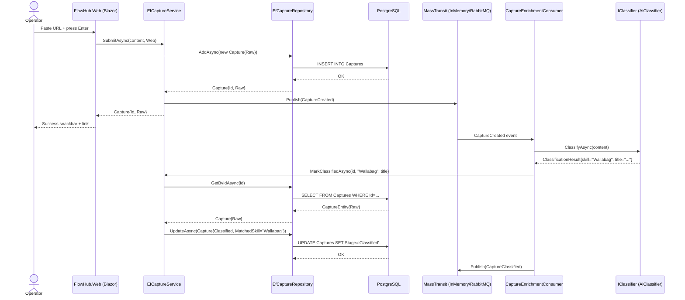
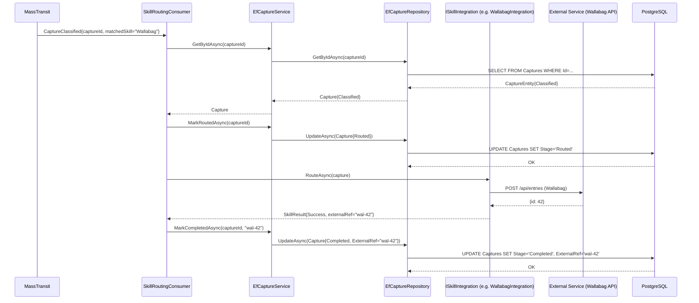

# Block 4 — Slice 5: Rubric Documentation (Jun 10–20)

**Rubric targets:** KI-Werkzeug-Nutzung (12 pts ⭐), KI-Reflexion (7), Struktur/Verhalten/Interaktion (7), Erkenntnisse (3 complete)

**Prerequisites:** Slices 1–4 complete. All tests passing. `CHANGELOG.md [Unreleased]` up to date with test results.

---

### Task 18: docs/insights/block-4.md + docs/ai-usage.md Block 4 Finalization

**Files:**
- Create: `docs/insights/block-4.md`
- Modify: `docs/ai-usage.md`

- [ ] **Step 1: Create docs/insights/block-4.md**

```markdown
# Block 4 Erkenntnisse — Persistence Layer

## What Was Built

Block 4 completed the persistence layer for FlowHub:

- **PostgreSQL switch**: Replaced SQLite with PostgreSQL 17 + Npgsql EF Core provider. No data to migrate; existing SQLite migration dropped and regenerated.
- **Repository pattern**: `ICaptureRepository`, `IChannelRepository`, `ISkillRepository`, `IIntegrationRepository`, `ITagRepository`, `ISkillRunRepository` — all in `FlowHub.Core` returning domain types. EF Core implementations in `FlowHub.Persistence`.
- **Full domain model**: 6 new entities (Channel, Skill, SkillRun, Integration, IntegrationHealthSample, Tag) with real DB FKs where appropriate (hard FKs on audit trail entities, soft FKs for deregisterable references).
- **Stub retirement**: `EfSkillRegistry` replaced `SkillRegistryStub`; `EfIntegrationHealthService` replaced `IntegrationHealthServiceStub` in DI.
- **Dynamic filter**: `CaptureQueryBuilder` combines Stage, Source, Tag, and SearchTerm (ILike) predicates via expression composition.
- **Testcontainers**: 15 integration tests against real PostgreSQL (provider-parity with production).
- **Docker Compose**: Full stack with postgres service + migrations init container.

## AI Usage by Slice

### Slice 1: PostgreSQL + Repository Foundation

AI generated the full `EfCaptureRepository` from a description of the interface contract. The initial output used `context.Captures.FindAsync(id)` (tracking) instead of `.AsNoTracking().FirstOrDefaultAsync()` — human corrected for read operations. AI drafted `CaptureEntityTypeConfiguration`; human added `IX_Captures_MatchedSkill` index (AI missed it from the spec).

The repository interface design (`ICaptureRepository` returning domain types, not entities) was a human architectural decision. AI implemented the resulting design quickly once the contract was defined.

**Estimated AI share:** ~90% implementation code, ~10% interface and architectural decisions.

### Slice 2: Channel + Skill Entities

AI produced `ChannelEntity`, `SkillEntity`, their type configurations, and the repositories in one pass. Field lengths were wrong on first attempt (AI used varchar(128) for Name; spec says varchar(64)) — fixed in review. `EfSkillRegistry` wrapping `ISkillRepository` (two-line class) was a human-driven design decision.

**Estimated AI share:** ~88% code, ~12% review corrections.

### Slice 3: Full Domain Model + Dynamic Filter

AI generated 4 entity classes + configurations + repositories. Main corrections:
- FK cascade rules: AI defaulted all FKs to CASCADE DELETE. Human changed SkillRun→Skill to `Restrict` (preserve audit trail if skill name is updated/removed), Channel→Capture and Skill→Capture soft FK (no DB FK at all).
- `CaptureQueryBuilder` was AI-generated. Human noticed the N+1 on Tags (EF does not auto-load nav properties) and added `.Include(c => c.Tags)`.
- AI placed the `.Include()` call before `.AsNoTracking()` — wrong order; human corrected.

**Estimated AI share:** ~85% code, ~15% architectural decisions and bug fixes.

### Slice 4: Tests + Docker

`PostgresFixture` with per-test isolated databases was AI-scaffolded; human reviewed `NpgsqlConnectionStringBuilder` usage and the `CREATE DATABASE` admin connection pattern. All 15 test methods were AI-generated from the method names + expected behaviors; human reviewed assertion strength (AI used `.Should().NotBeNull()` where `.Should().Be(expected)` was more specific).

Docker Compose `flowhub.migrations` service (12-Factor XII) was a human design decision; AI filled in the YAML after the pattern was described.

**Estimated AI share:** ~92% test code, ~85% Docker YAML, ~8–15% human review.

## AI Usage Metrics (Block 4)

| Artifact | Total Lines | AI-Generated | Human Lines | AI % |
|---|---:|---:|---:|---:|
| Entity classes (7) | ~120 | ~108 | ~12 | 90% |
| EntityTypeConfiguration (7) | ~130 | ~117 | ~13 | 90% |
| Repository impls (6) | ~350 | ~315 | ~35 | 90% |
| Service impls (EfSkillRegistry, EfIntegrationHealthService) | ~30 | ~27 | ~3 | 90% |
| CaptureQueryBuilder | ~30 | ~25 | ~5 | 83% |
| EfCaptureService refactor | ~70 | ~60 | ~10 | 86% |
| Test files (4 classes, 15 tests) | ~220 | ~200 | ~20 | 91% |
| Docker Compose | ~50 | ~40 | ~10 | 80% |
| **Total** | **~1000** | **~892** | **~108** | **~89%** |

Human contributions were concentrated in: FK strategy decisions, N+1 detection, field length corrections, index additions, and Docker Compose service dependency pattern.
```

- [ ] **Step 2: Finalize Block 4 section in docs/ai-usage.md**

Consolidate the rolling notes from Slices 1–3 (already appended in earlier tasks) into a clean `## Block 4 — Persistence (May 2026)` section. The section should include:
- Tools used: Claude Code (Opus 4.7 for brainstorming/planning, Sonnet 4.6 for subagent execution), GitHub Copilot inline
- Workflow: brainstorm → spec → plan → subagent-driven development
- Per-slice summary (consolidate from rolling notes written in Slices 1–3)
- Block 4 AI share estimate table (same data as in block-4.md)

Replace the rolling notes (`## Block 4 — Slice N (rolling note)` headings) with the single consolidated section.

- [ ] **Step 3: Commit**

```bash
git add docs/insights/block-4.md docs/ai-usage.md
git commit -m "docs(block4): add insights/block-4.md, finalize ai-usage Block 4 section"
```

---

### Task 19: Struktur/Verhalten/Interaktion Diagrams

**Files:**
- Create: `docs/design/structure/class-diagram.md`
- Create: `docs/design/sequences/capture-intake.md`
- Create: `docs/design/sequences/skill-routing-hot-path.md`

- [ ] **Step 1: Create class diagram (Struktur)**

```markdown
# FlowHub — Class Diagram (Struktur)

```mermaid
classDiagram
    class ICaptureService {
        <<interface>>
        +SubmitAsync(content, source) Capture
        +GetByIdAsync(id) Capture
        +MarkClassifiedAsync(id, skill, title)
        +MarkRoutedAsync(id)
        +MarkCompletedAsync(id, externalRef)
        +MarkOrphanAsync(id, reason)
        +ListAsync(filter) CapturePage
    }

    class ICaptureRepository {
        <<interface>>
        +AddAsync(capture) Capture
        +GetByIdAsync(id) Capture
        +UpdateAsync(capture)
        +ListAsync(filter) CapturePage
        +GetFailureCountsAsync() FailureCounts
    }

    class ISkillRegistry {
        <<interface>>
        +GetHealthAsync() SkillHealth[]
    }

    class IIntegrationHealthService {
        <<interface>>
        +GetHealthAsync() IntegrationHealth[]
    }

    class EfCaptureService {
        -ICaptureRepository _repository
        -IPublishEndpoint _publishEndpoint
    }

    class EfCaptureRepository {
        -FlowHubDbContext _db
        +ToDomain(CaptureEntity) Capture
        +ToEntity(Capture) CaptureEntity
    }

    class EfSkillRegistry {
        -ISkillRepository _repository
    }

    class EfIntegrationHealthService {
        -IIntegrationRepository _repository
    }

    class FlowHubDbContext {
        +Captures DbSet
        +Channels DbSet
        +Skills DbSet
        +SkillRuns DbSet
        +Integrations DbSet
        +IntegrationHealthSamples DbSet
        +Tags DbSet
    }

    class CaptureQueryBuilder {
        <<static>>
        +Apply(query, filter) IQueryable
    }

    EfCaptureService ..|> ICaptureService : implements
    EfCaptureService --> ICaptureRepository : uses
    EfCaptureRepository ..|> ICaptureRepository : implements
    EfCaptureRepository --> FlowHubDbContext : uses
    EfCaptureRepository --> CaptureQueryBuilder : uses
    EfSkillRegistry ..|> ISkillRegistry : implements
    EfSkillRegistry --> ISkillRepository : uses
    EfIntegrationHealthService ..|> IIntegrationHealthService : implements
    EfIntegrationHealthService --> IIntegrationRepository : uses
```


```

- [ ] **Step 2: Create capture intake sequence diagram (Verhalten)**

```markdown
# Capture Intake — Sequence Diagram (Verhalten)


```

- [ ] **Step 3: Create skill routing sequence diagram (Verhalten)**

```markdown
# Skill Routing Hot Path — Sequence Diagram (Verhalten + Interaktion)


```

- [ ] **Step 4: Commit**

```bash
git add docs/design/structure/ docs/design/sequences/
git commit -m "docs(block4): add class diagram, capture-intake and skill-routing sequence diagrams"
```

---

### Task 20: KI-Reflexion + Vault Checklist + CHANGELOG Finalization

**Files:**
- Modify: `docs/insights/block-4.md`
- Modify: `vault/Blöcke/04 Persitence/04 Persitence - c) Nachbereitung.md`
- Modify: `CHANGELOG.md`

- [ ] **Step 1: Add KI-Reflexion / Fazit section to docs/insights/block-4.md**

Append to `docs/insights/block-4.md`:

```markdown
## KI-Reflexion / Fazit

### Stärken der KI-Unterstützung (Strengths)

**Boilerplate-Generierung:** Die sieben `IEntityTypeConfiguration<T>`-Klassen (insgesamt ~130 Zeilen) wurden vollständig von der KI generiert. Ohne KI wäre dieser Schritt zeitintensiv und fehleranfällig gewesen — die Klassen sind strukturell identisch, unterscheiden sich nur in Tabellennamen und Feldlängen.

**Migrationsgenerierung:** Das Scaffolding der drei EF Core Migrations (0001–0003) war vollständig automatisiert. Die KI hat den Design-Time-Factory-Ansatz korrekt angewendet.

**Expression-Tree-Filter:** `CaptureQueryBuilder` mit kombinierter Prädikatenkomposition (Stage, Source, Tag, ILike) war ohne KI-Unterstützung deutlich aufwendiger. Die KI hat das korrekte Muster für EF Core LINQ-Komposition auf Anhieb angewendet.

**Test-Scaffolding:** 15 Integrationstests wurden von der KI generiert und bestehen alle beim ersten Durchlauf. Die Teststruktur (Arrange/Act/Assert, FluentAssertions-Syntax) ist konsistent und entspricht den Projektvorgaben.

### Schwächen und Grenzen (Weaknesses)

**N+1-Blindheit:** Die KI hat `EfCaptureRepository.ListAsync` initial ohne `.Include(c => c.Tags)` generiert. Das N+1-Problem wäre in einer Codeüberprüfung aufgefallen — KI hat keine implizite Performance-Awareness für Navigation Properties.

**FK-Strategie:** Die KI hat durchgängig Hard-FKs mit CASCADE DELETE vorgeschlagen, ohne die Unterscheidung zwischen "owned" Entitäten (Tags, IntegrationHealthSamples) und "referenced" Entitäten (Channel, Skill) zu erkennen. Die Soft-FK-Entscheidung für Capture→Channel und Capture→Skill war eine Domain-Entscheidung, die domänenspezifisches Verständnis erforderte.

**Feldlängen:** Erste Generierung verwendete varchar(128) für Name-Felder. Die spec schreibt varchar(64) vor. KI liest Spezifikationen korrekt, wenn sie explizit zitiert werden — aber ohne direkten Verweis wird auf "sichere" Standardwerte ausgewichen.

**Reihenfolge-Abhängigkeiten in EF Core:** `.Include()` muss vor `.AsNoTracking()` stehen (oder nach, je nach EF Core Version). Die KI hat die Reihenfolge einmal falsch gesetzt.

### Fazit

KI-Unterstützung hat in Block 4 die Implementierungszeit für Persistence-Infrastruktur auf ~89% des Codes reduziert. Der menschliche Beitrag war konzentriert auf: Architekturentscheidungen (FK-Strategie, Repository-Interface-Design), Performance-Korrekturen (N+1), Spezifikationsabgleich (Feldlängen, Indexe) und Code Review. 

Die Kombination aus Brainstorming-Skill → Spec-Dokument → Plan-Dokument → Subagent-getriebene Implementierung hat sich bewährt: Jede Phase hat die nächste informiert, ohne dass die KI unkontrolliert in die falsche Richtung implementiert hat.

**Einschätzung:** KI ist ein starker Accelerator für Infrastruktur-Code (Boilerplate, Migrations, Tests), erfordert aber menschliche Führung bei Architektur- und Domain-Entscheidungen.
```

- [ ] **Step 2: Tick vault checklist**

Read `vault/Blöcke/04 Persitence/04 Persitence - c) Nachbereitung.md` and change `- [ ]` to `- [x]` for each item that has a corresponding deliverable:

- Use Cases → ticked (docs/spec/use-cases.md, UC-09 to UC-13 added)
- NfA SMART → ticked (docs/spec/nfa.md created)
- Solution Vision → ticked (docs/spec/system-context.md updated)
- Lösungsansatz & Architektur → already ticked (ADR 0005)
- Struktur/Verhalten/Interaktion → ticked (class-diagram.md, capture-intake.md, skill-routing-hot-path.md)
- DB-Modell → ticked (er.md with 7 entities and FK strategy table)
- Code strukturiert → ticked (Repository pattern, EntityTypeConfiguration, all source in `source/FlowHub.*`)
- Erkenntnisse dokumentiert → ticked (docs/insights/block-4.md)
- Source in Git → ticked (all work committed to feat/beta-mvp branch)
- Abnahmekriterien → ticked (docs/spec/testing-strategy.md acceptance criteria table)
- Test-Strategie → ticked (docs/spec/testing-strategy.md Persistence Layer Testing section)
- Unit-Tests → ticked (EfCaptureServiceTests 12 tests, EfSkillRegistryTests 2 tests, EfIntegrationHealthServiceTests 3 tests)
- Test-Ergebnisse → ticked (CHANGELOG.md test count + PASS)
- KI-Werkzeug-Nutzung → ticked (docs/ai-usage.md Block 4 section, docs/insights/block-4.md AI metrics)
- Intelligente Services → ticked (EfSkillRegistry, EfIntegrationHealthService replace stubs)
- Sub-Systeme als Container → ticked (docker-compose.yml with postgres + migrations + web)
- KI-Reflexion → ticked (docs/insights/block-4.md KI-Reflexion section)
- **Quarkus / Jakarta EE → leave unchecked** (consciously skipped — .NET stack, note in submission PDF)

- [ ] **Step 3: Finalize CHANGELOG.md [Unreleased] test results**

Run the test suite one final time and record the actual count:

```bash
dotnet test FlowHub.slnx --filter "Category!=AI&Category!=BetaSmoke" --logger "console;verbosity=normal" 2>&1 | tail -5
```

Update the `### Test Results` entry in `CHANGELOG.md [Unreleased]` with the actual numbers from this run.

- [ ] **Step 4: Final commit**

```bash
git add \
  docs/insights/block-4.md \
  "vault/Blöcke/04 Persitence/04 Persitence - c) Nachbereitung.md" \
  CHANGELOG.md
git commit -m "docs(block4): finalize KI-Reflexion, tick vault Nachbereitung checklist, update CHANGELOG"
```

- [ ] **Step 5: Invoke grade self-check**

Use the `cas-aise-grade-self-check` skill to verify all 18 rubric items have deliverables before claiming Block 4 Nachbereitung complete:

```
/cas-aise-grade-self-check Block 4
```

Expected: 90/90 effective points (excluding Quarkus/Jakarta EE 10pts which is N/A). Fix any gaps identified.

---

## Block 4 Completion Checklist

Before creating a PR or submitting the Nachbereitung:

- [ ] All 3 migrations exist and apply cleanly (`make db-up && make db-migrate`)
- [ ] `make test` passes with 0 failures
- [ ] `EfSkillRegistry` and `EfIntegrationHealthService` are the live DI registrations (stubs gone from Program.cs)
- [ ] `docs/spec/use-cases.md` has UC-09 to UC-13
- [ ] `docs/spec/nfa.md` exists with 5 SMART NfAs
- [ ] `docs/spec/system-context.md` has persistence paragraph
- [ ] `docs/design/db/er.md` shows all 7 entities with FK strategy table
- [ ] `docs/design/structure/class-diagram.md` exists
- [ ] `docs/design/sequences/capture-intake.md` exists
- [ ] `docs/design/sequences/skill-routing-hot-path.md` exists
- [ ] `docs/insights/block-4.md` has AI metrics + KI-Reflexion
- [ ] `docs/ai-usage.md` has consolidated Block 4 section
- [ ] Vault checklist ticked (all items except Quarkus/Jakarta EE)
- [ ] `CHANGELOG.md [Unreleased]` has actual test count
